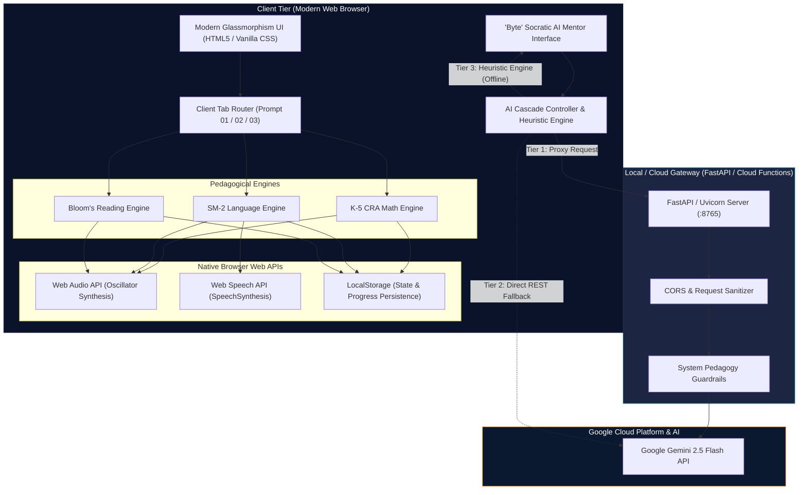
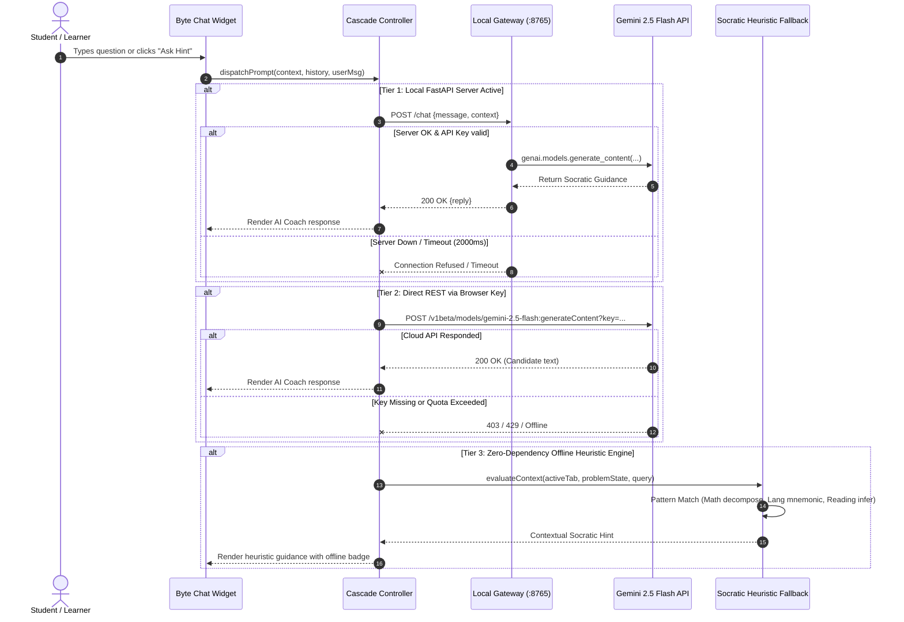
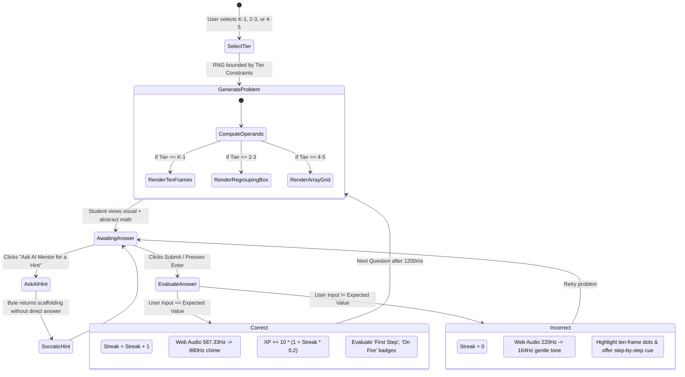
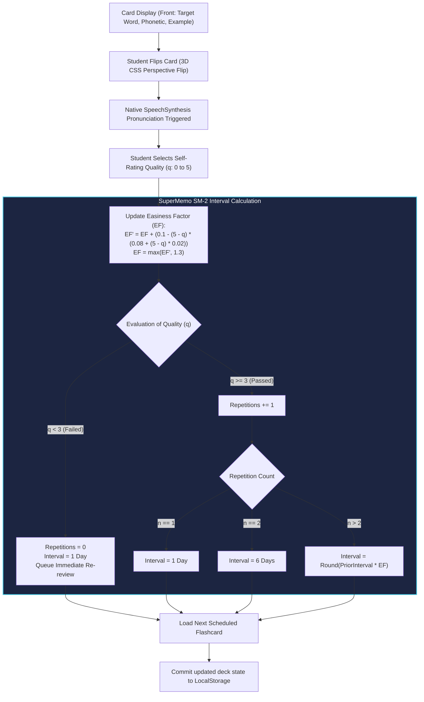
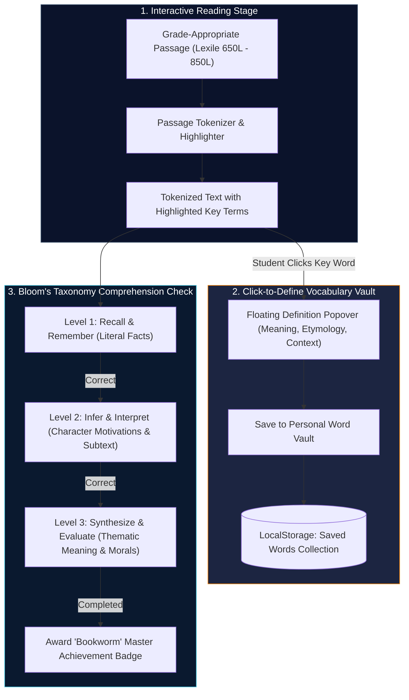
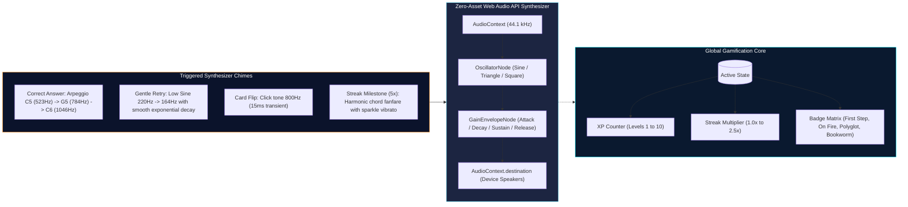
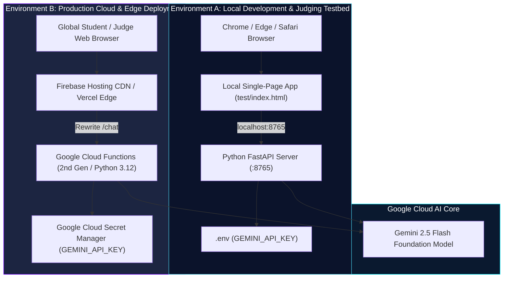
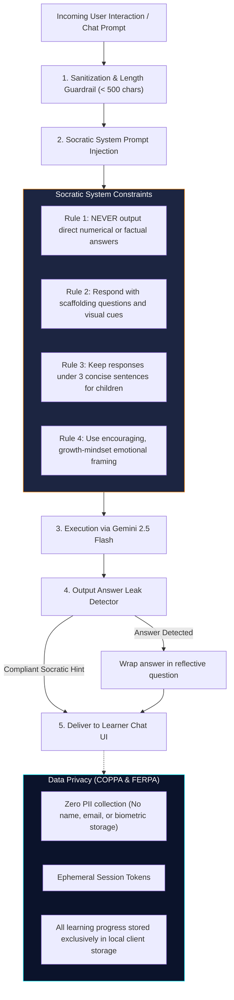

# 🏛️ Nerdy AI Learning Suite — System Architecture

Comprehensive architectural specification, visual sequence diagrams, state machines, and data flows for the **Nerdy AI Learning Suite**.

---

## 📑 Table of Contents

1. [High-Level System Architecture](#1-high-level-system-architecture)
2. [Multi-Tier AI Pedagogy Cascade](#2-multi-tier-ai-pedagogy-cascade)
3. [Educational Domain Engines](#3-educational-domain-engines)
   - [3.1 Prompt 01: K–5 Math Game Engine (CRA Framework)](#31-prompt-01-k5-math-game-engine-cra-framework)
   - [3.2 Prompt 02: Language Learning Engine (SuperMemo SM-2)](#32-prompt-02-language-learning-engine-supermemo-sm-2)
   - [3.3 Prompt 03: Reading & Comprehension Engine (Bloom's Taxonomy)](#33-prompt-03-reading--comprehension-engine-blooms-taxonomy)
4. [Universal Gamification & Audio Synthesizer Pipeline](#4-universal-gamification--audio-synthesizer-pipeline)
5. [Local Testbed vs. Cloud Production Topology](#5-local-testbed-vs-cloud-production-topology)
6. [Security, COPPA/FERPA Compliance, & Socratic Guardrails](#6-security-coppaferpa-compliance--socratic-guardrails)
7. [Component & Data Model Specifications](#7-component--data-model-specifications)

---

## 1. High-Level System Architecture

The Nerdy AI Learning Suite is constructed on a **decoupled, edge-capable, local-first architecture**. The application is designed to function seamlessly as an offline-capable Single Page Application (SPA), while dynamically upgrading to real-time Socratic intelligence via Google Gemini 2.5 Flash when connectivity or API credentials are provided.



---

## 2. Multi-Tier AI Pedagogy Cascade

To guarantee **zero downtime** and ensure a seamless experience for students during judging and real-world school usage, the AI companion ("Byte") employs a **3-Tier Cascade Decision Flow**:



---

## 3. Educational Domain Engines

### 3.1 Prompt 01: K–5 Math Game Engine (CRA Framework)

The Math Engine adheres to Jerome Bruner's **Concrete–Representational–Abstract (CRA)** sequence:
1. **Concrete/Representational:** Dynamic SVG Ten-Frames and grouping boxes with color-coded dot counters.
2. **Abstract:** Symbolic numerical equations ($A + B = ?$).
3. **Adaptive Tiers:** 
   - Tier 1: Grades K–1 (Addition & Subtraction $\le 10$, visual ten-frame representation)
   - Tier 2: Grades 2–3 (Two-digit regrouping $\le 50$)
   - Tier 3: Grades 4–5 (Multiplication arrays & mental math facts up to $12 \times 12$)



---

### 3.2 Prompt 02: Language Learning Engine (SuperMemo SM-2)

The Language Engine uses the proven **SuperMemo-2 (SM-2)** algorithm for optimal spaced repetition, paired with the browser's native **SpeechSynthesis API** for genuine pronunciation in Spanish, French, and English:



---

### 3.3 Prompt 03: Reading & Comprehension Engine (Bloom's Taxonomy)

The Reading Module structures literary comprehension through **interactive text parsing**, an instant **Vocabulary Vault**, and multi-level **Bloom's Taxonomy Assessment**:



---

## 4. Universal Gamification & Audio Synthesizer Pipeline

To avoid broken sound effects or external MP3 dependency 404s, the application incorporates a **pure Web Audio API synthesizer** that dynamically shapes harmonic frequencies using oscillator and gain envelope nodes:



---

## 5. Local Testbed vs. Cloud Production Topology

The application supports identical runtime behavior across two operational environments:



---

## 6. Security, COPPA/FERPA Compliance, & Socratic Guardrails

Because the Nerdy AI Learning Suite targets K–12 and higher education learners, strict safety and regulatory guardrails are embedded into the architectural design:



---

## 7. Component & Data Model Specifications

### 7.1 Client-Side State Schema (`localStorage`)

```json
{
  "nerdy_suite_v1": {
    "user": {
      "level": 2,
      "xp": 145,
      "streak": 5,
      "activeTier": "k1"
    },
    "math": {
      "solvedCount": 18,
      "currentTier": "k1",
      "mistakeHistory": []
    },
    "language": {
      "activeLanguage": "es",
      "deck": [
        {
          "id": "es_01",
          "target": "la manzana",
          "translation": "the apple",
          "reps": 3,
          "ef": 2.5,
          "interval": 6,
          "nextReviewDate": "2026-09-08T00:00:00.000Z"
        }
      ]
    },
    "reading": {
      "activeStoryId": "story_01",
      "savedWords": ["ancient", "luminous", "curiosity"],
      "comprehensionLevel": 2
    },
    "achievements": {
      "first_step": true,
      "on_fire": true,
      "polyglot": false,
      "bookworm": false
    }
  }
}
```

### 7.2 Backend API Contract (`FastAPI / Cloud Functions`)

#### Endpoint: `POST /chat`
- **Request Headers:** `Content-Type: application/json`
- **Request Body:**
  ```json
  {
    "message": "Why is 2 + 6 equal to 8?",
    "context": {
      "tab": "math",
      "tier": "k1",
      "problem": "2 + 6 = ?",
      "streak": 3
    }
  }
  ```
- **Response Body (200 OK):**
  ```json
  {
    "status": "success",
    "reply": "Look closely at the ten-frame! You have 2 blue dots and 6 yellow dots. What happens when you count on from the 6 yellow dots?",
    "model": "gemini-2.5-flash",
    "source": "gemini_api"
  }
  ```

#### Endpoint: `GET /health`
- **Response Body (200 OK):**
  ```json
  {
    "status": "healthy",
    "service": "nerdy-hackathon-backend",
    "version": "1.0.0",
    "gemini_configured": true
  }
  ```

---

## 8. Summary & Architectural Highlights

1. **Self-Contained & Resilient:** Zero broken images, zero external audio 404s, and multi-tier AI fallback ensuring the app is always functional.
2. **Pedagogically Rigorous:** Integrates real learning science (Bruner's CRA, SuperMemo SM-2, and Bloom's Taxonomy).
3. **Built for Scale:** Clean separation of concerns allows immediate conversion to a global multi-tenant microservices architecture as outlined in [`STARTUP_IDEA_AI_EDUCATION_SHOPIFY.md`](file:///C:/Users/sath7/.gemini/nerdy-hackathon-repo/STARTUP_IDEA_AI_EDUCATION_SHOPIFY.md).
