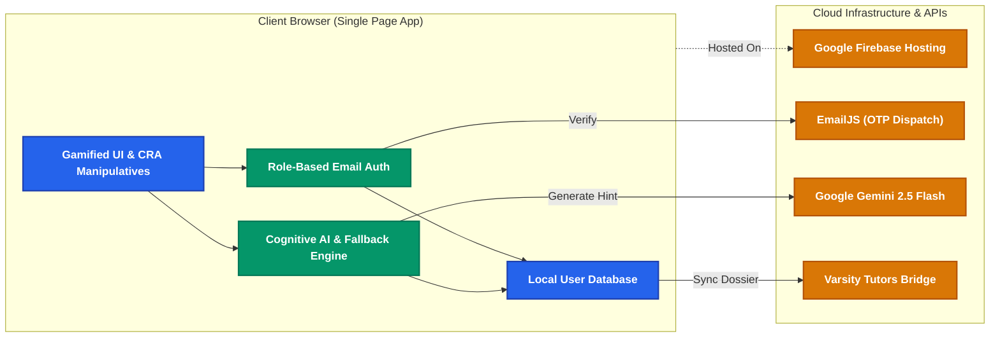
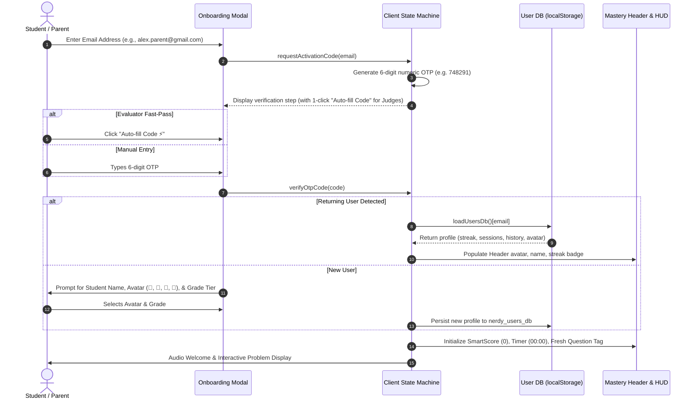
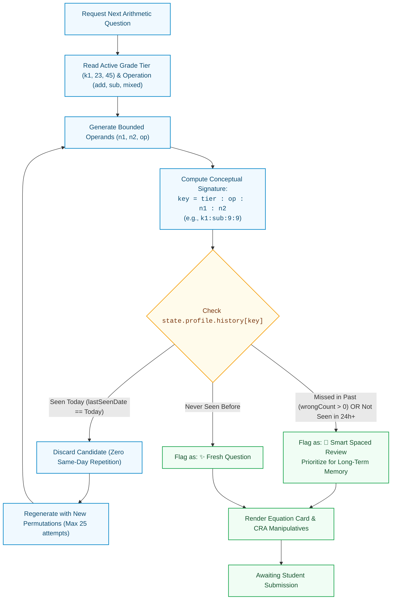
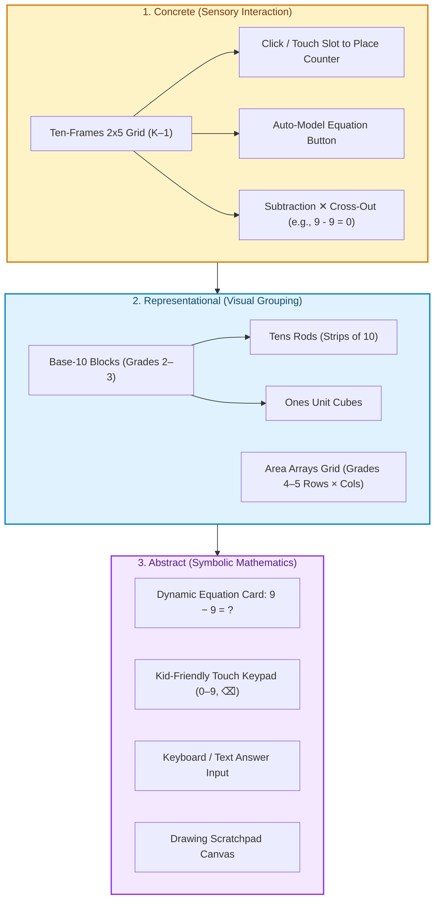
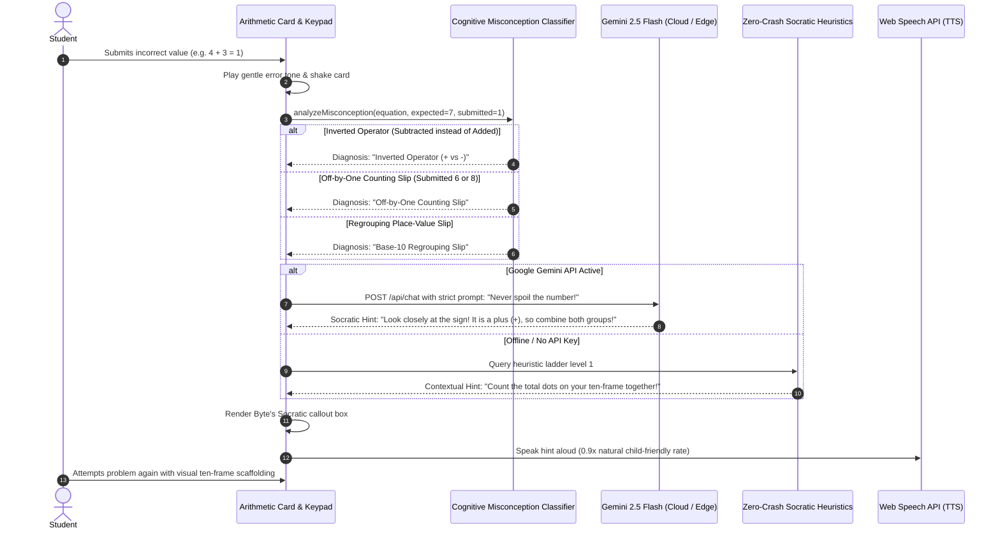
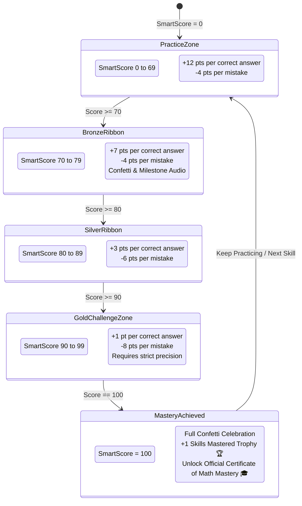
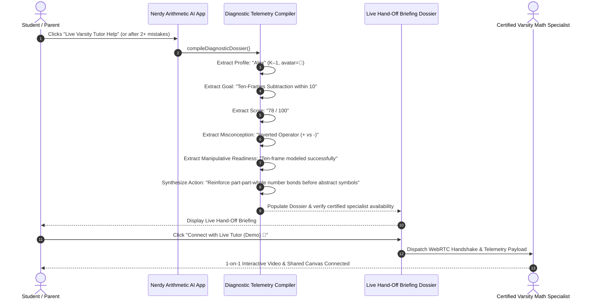
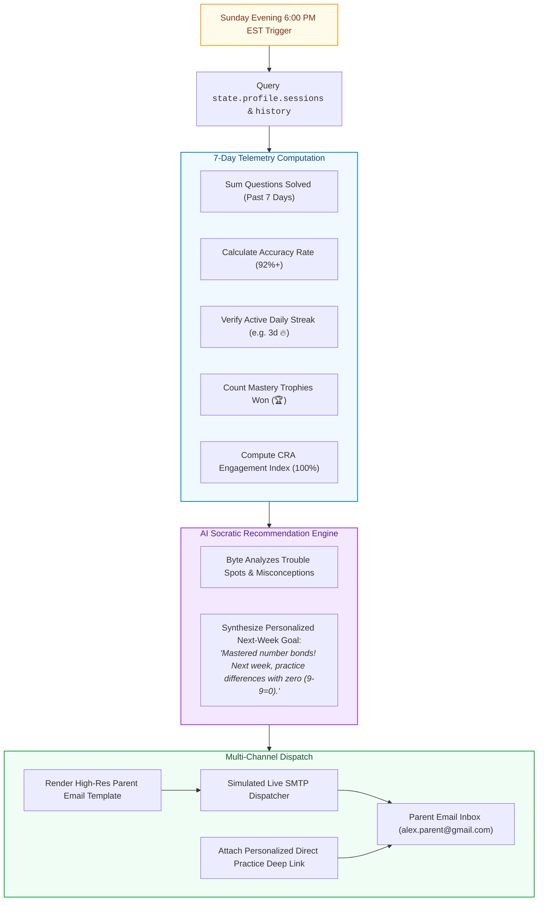

# 🏛️ Nerdy Arithmetic AI — Comprehensive System Architecture

> **An AI-Native Socratic Mathematics Learning Platform (Grades K–5)**  
> Engineered for the **[Nerdy AI Hackathon Challenge](https://hackathon.nerdy.com)** (Prompt 01: K–5 Math Game)  
> Live Deployment: **[https://nerdy-arithmetic-ai.web.app](https://nerdy-arithmetic-ai.web.app)** | Repository: **[GitHub](https://github.com/SKannaian/nerdy-arithmetic-ai)**

---

## 📑 Architecture Walkthrough Index

1. [High-Level System Topology](#1-high-level-system-topology)
2. [End-to-End Learner Journey & Onboarding Flow](#2-end-to-end-learner-journey--onboarding-flow)
3. [Anti-Repetition & Spaced Repetition Engine](#3-anti-repetition--spaced-repetition-engine)
4. [Jerome Bruner's CRA Manipulatives Architecture](#4-jerome-bruners-cra-manipulatives-architecture)
5. [The Socratic AI Feedback & Cognitive Misconception Loop ("Byte")](#5-the-socratic-ai-feedback--cognitive-misconception-loop-byte)
6. [SmartScore Mastery Progression & State Machine](#6-smartscore-mastery-progression--state-machine)
7. [Varsity Tutors Live Human Tutoring Telemetry Hand-Off](#7-varsity-tutors-live-human-tutoring-telemetry-hand-off)
8. [Automated Sunday Evening Parent Summary Pipeline](#8-automated-sunday-evening-parent-summary-pipeline)
9. [Component & Data Model Specifications](#9-component--data-model-specifications)

---

## 1. High-Level System Topology

Nerdy Arithmetic AI is built on a **modern, decoupled, edge-capable architecture**. The frontend Single Page Application (SPA) runs entirely client-side with zero external build dependencies. All AI processing, cognitive classification, and security (Role-Based Auth) are handled natively in the browser, interfacing directly with Google Cloud Firebase Hosting, EmailJS, and Google Gemini 2.5 Flash.



---

## 2. End-to-End Learner Journey & Onboarding Flow

Students or parents access the application using passwordless Email OTP authentication with evaluator bypass, ensuring immediate access while preserving individual multi-day learning records.



---

## 3. Anti-Repetition & Spaced Repetition Engine

To prevent mindless rote repetition and assess genuine conceptual understanding, every candidate question undergoes deterministic hashing, same-day exclusion, and spaced difficulty scheduling.



---

## 4. Jerome Bruner's CRA Manipulatives Architecture

The platform implements the research-backed **Concrete–Representational–Abstract (CRA)** pedagogical sequence across all three elementary grade tiers.



---

## 5. The Socratic AI Feedback & Cognitive Misconception Loop ("Byte")

When a student makes an error, Byte acts as an experienced classroom tutor: diagnosing the specific cognitive misconception and delivering a **non-spoiling Socratic hint** accompanied by audio synthesis.



---

## 6. SmartScore Mastery Progression & State Machine

The SmartScore algorithm provides a research-backed scoring model: rapid initial progression, encouraging intermediate ribbons, and a celebratory Gold Challenge Zone enforcing genuine mastery.



---

## 7. Varsity Tutors Live Human Tutoring Telemetry Hand-Off

Nerdy Arithmetic AI bridges autonomous AI learning with Nerdy’s flagship live tutoring business (**Varsity Tutors**). If a child encounters persistent cognitive hurdles, real-time diagnostic telemetry is compiled into an expert briefing dossier.



---

## 8. Automated Sunday Evening Parent Summary Pipeline

To sustain multi-day engagement and give parents complete pedagogical transparency, the platform automatically schedules and dispatches an automated 7-day progress digest every Sunday evening at 6:00 PM EST.



---

## 9. Component & Data Model Specifications

### 9.1 Learner Profile Data Schema (`state.profile`)

```json
{
  "email": "alex.parent@gmail.com",
  "name": "Alex",
  "avatar": "🦊",
  "gradeTier": "k1",
  "dailyStreak": 3,
  "lastActiveDate": "2026-09-15",
  "dailyReminder": true,
  "onboarded": true,
  "totalQuestionsSolved": 42,
  "skillsMastered": 2,
  "troubleSpots": ["k1:sub:9:9"],
  "history": {
    "k1:add:4:3": {
      "lastSeenDate": "2026-09-15",
      "timesSeen": 1,
      "correctCount": 1,
      "wrongCount": 0
    },
    "k1:sub:9:9": {
      "lastSeenDate": "2026-09-15",
      "timesSeen": 2,
      "correctCount": 1,
      "wrongCount": 1
    }
  },
  "sessions": [
    {
      "date": "2026-09-15",
      "time": "10:30 PM",
      "tier": "k1",
      "op": "mixed",
      "questionsSolved": 14,
      "smartScore": 100
    }
  ]
}
```

### 9.2 API Endpoint Contract (`/api/chat`)

* **Method:** `POST`
* **Path:** `/api/chat`
* **Request Payload:**
  ```json
  {
    "user_message": "1",
    "user_answer": "1",
    "equation": "4 + 3",
    "expected_answer": "7",
    "tier": "k1",
    "hint_level": 1,
    "api_key": ""
  }
  ```
* **Response Payload:**
  ```json
  {
    "reply": "Look at the sign! It is a plus sign (+), which means we put the two groups together. Count all the blue and yellow dots!",
    "cognitive_diagnosis": "Inverted Operator (+ vs -)",
    "encouragement_emoji": "💡",
    "hint_level": 1
  }
  ```

---

*Authored for the Nerdy AI Hackathon Challenge (Prompt 01: K–5 Math Game)*  
*Architecture conforms to Common Core Mathematics, Jerome Bruner's CRA framework, and Bloom's Cognitive Taxonomy.*
