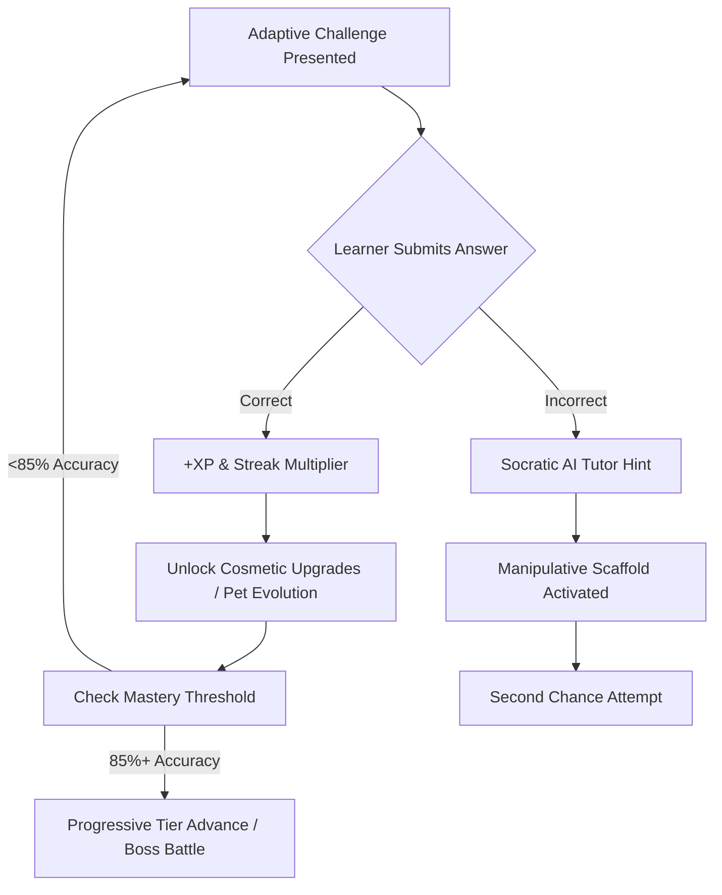

# Prompt 01: K–5 Math Game 🧮🎮

> **Official Prompt:** *"Develop an interactive, gamified math experience tailored for elementary students that makes foundational arithmetic concepts both intuitive and engaging. We're looking for innovative mechanics that encourage steady progression and reward mastery of core numeracy skills."*

---

## 🎯 Executive Summary & Learning Objective

Elementary math education faces a dual hurdle: **math anxiety** and **passive rote drill fatigue**. Traditional worksheets and basic flashcard apps reward fast guessing rather than conceptual mastery. 

To win this track, your product must blend **pedagogical rigor** (Common Core State Standards for Mathematics - CCSS.MATH) with **irresistible game design loops** and **agentic AI personalization**. The learner shouldn't feel like they are doing math homework—they should feel like they are leveling up a character, solving mysteries, or defending a realm using numeracy powers.

---

## 📚 Pedagogical Architecture

### 1. Grade-Band Competency Map
Your game should dynamically adapt across three primary developmental bands:

| Band | Grade Level | Target Mathematical Concepts | Cognitive Development Stage |
| :--- | :--- | :--- | :--- |
| **Tier 1** | **Grades K–1** | Number sense, single-digit addition/subtraction within 10 & 20, visual subitizing (ten-frames, tally groups), missing addends ($3 + ? = 7$). | Concrete Operational: Relies on visual anchors, counters, and physical metaphors. |
| **Tier 2** | **Grades 2–3** | Two-digit addition/subtraction with & without regrouping, introduction to skip counting, arrays, multiplication facts (2s, 5s, 10s), place value (hundreds/tens/ones). | Representational: Transitioning from physical counting to symbolic abstraction and pattern recognition. |
| **Tier 3** | **Grades 4–5** | Multi-digit multiplication, long division intuition, fractions as parts of a whole, order of operations, decimal basics, multi-step word problems. | Abstract Thinking: Capable of multi-step logical operations and relational thinking. |

### 2. Concrete-Representational-Abstract (CRA) Sequence
Ensure the game doesn't just display abstract symbols (`7 + 5 = ?`), but allows toggleable scaffolds:
1. **Concrete:** Virtual manipulatives (e.g., draggable apple counters, gems, or base-10 blocks).
2. **Representational:** Number lines, ten-frames, bar models, and dot arrays.
3. **Abstract:** Formal numerical equations.

---

## 🕹️ Core Game Mechanics & Gamification Loops



### 1. Dynamic Streak & Multiplier System
- **Streak Fire:** Consecutive correct answers trigger combo streaks (e.g., 3x combo triggers "Hyper Charge" mode with golden animations).
- **Graceful Failure Mechanics:** A wrong answer **never** abruptly resets the streak to zero with a harsh red buzz. Instead, it "cracks" a shield or offers an instant visual scaffold, reducing frustration.

### 2. "Math Boss" Milestone Encounters
- Every 10 mastered skills culminates in a timed or strategic "Boss Encounter" (e.g., *The Fraction Dragon* or *The Regrouping Golem*), where students must solve multi-step problems to cast spells or dodge attacks.

### 3. Progressive Mastery & Skill Trees
- Visual "Constellation" or "Island Map" showing the learner's journey. Nodes turn from Bronze (Attempted) $\rightarrow$ Silver (Fluent) $\rightarrow$ Gold (Mastered) $\rightarrow$ Diamond (Speed Challenge).

---

## 🤖 Agentic AI Integration & Architecture

To satisfy Nerdy's standard for an **AI Product Engineer**, AI should not be an afterthought; it must power the core game loop:

### 1. Adaptive Difficulty Engine (Zone of Proximal Development)
Instead of hardcoded RNG problems, an AI model calculates the learner's real-time **Elo rating** or uses an **Item Response Theory (IRT)** model:
- Tracks latency per answer (hesitation detection).
- If the learner is answering $<2$ seconds with 100% accuracy, dynamically introduces word problems or missing-operator problems (`5 [?] 4 = 20`).
- If latency spikes $>15$ seconds, automatically switches to visual scaffolds.

### 2. Error Diagnostic & Socratic Hint Generation
When a student answers incorrectly, the AI diagnoses the specific misconception:
- **Off-by-one error:** Counting fingers slip.
- **Directional subtraction error:** Subtracting smaller digit from larger digit regardless of order (e.g., $42 - 17 = 35$ because $7 - 2 = 5$).
- **Regrouping forgetfulness:** Neglecting the carried 10.

#### Prompt Engineering for the Socratic Math Companion:
```markdown
System Prompt:
You are "Byte", an encouraging robotic math companion for elementary school students.
Target Grade: {grade_band}
Current Equation: {equation}
Correct Answer: {correct_answer}
Student Answer: {student_answer}

Diagnose the student's mistake. DO NOT give away the answer.
Provide a single, warm, one-sentence guiding question using visual or real-world metaphors (e.g., pizzas, coins, jumping frogs) to help the student self-correct. Keep language simple, enthusiastic, and positive!
```

---

## 🛠️ Recommended Technical Stack & Implementation

- **Frontend:** Next.js 14 / React 18 + TailwindCSS + Framer Motion (for punchy particle physics, celebratory confetti, and smooth card transitions).
- **Game Rendering:** HTML5 Canvas or Phaser.js for interactive draggable manipulatives.
- **Audio:** Web Audio API for custom synthesized chimes, streak chords, and positive audio reinforcement.
- **Backend / AI:** Python FastAPI or Next.js Edge Routes with OpenAI GPT-4o-mini / Claude 3.5 Sonnet / Gemini 1.5 Flash for microsecond hint generation.
- **Persistence:** LocalStorage or Supabase (PostgreSQL) for user stats, unlocked badges, and streak retention.

### Sample Problem Generation & Mastery Schema
```typescript
interface MathProblem {
  id: string;
  tier: 'k1' | 'g23' | 'g45';
  equation: string;
  operands: number[];
  operator: '+' | '-' | '×' | '÷';
  correctAnswer: number;
  visualScaffoldType: 'ten-frame' | 'number-line' | 'array' | 'none';
  difficultyElo: number;
  hints: string[];
}

interface StudentSessionState {
  userId: string;
  currentTier: 'k1' | 'g23' | 'g45';
  currentStreak: number;
  longestStreak: number;
  totalScore: number;
  misconceptionLog: Array<{
    problemId: string;
    studentAnswer: number;
    diagnosedError: string;
    timestamp: string;
  }>;
}
```

---

## 🎬 2-to-3 Minute Demo Video Walkthrough Blueprint

Your demo video must immediately hook Nerdy's engineering leadership:

| Timestamp | Section | Screen Visual | Spoken Talking Point |
| :--- | :--- | :--- | :--- |
| **0:00 – 0:30** | **The Hook & Problem** | Live app running with fluid particle effects. | *"Most K-5 math apps are digital worksheets that induce anxiety. Here is how we turned foundational numeracy into an adaptive, AI-scaffolded adventure."* |
| **0:30 – 1:15** | **Core Gameplay & Progression** | Solve 2 problems; show streak multiplier firing and cosmetic avatar upgrade unlock. | *"Notice how progression works: as streak builds, visual rewards trigger. Watch how changing grade bands shifts both the problem space and the tactile manipulatives."* |
| **1:15 – 2:00** | **AI Socratic Scaffolding (The 'Wow' Feature)** | Deliberately enter an erroneous answer ($43 - 18 = 35$). | *"Notice the AI doesn't just say 'Wrong'. It diagnoses the regrouping bug in real-time and provides a visual ten-frame hint so the learner discovers the fix."* |
| **2:00 – 2:45** | **Architecture & Under the Hood** | Quick cut to code / architecture diagram. | *"Built with React, Tailwind, and Edge AI streaming. Sub-200ms latency ensures the child stays in the flow state."* |
| **2:45 – 3:00** | **Future Vision & Wrap Up** | Summary slide with GitHub link. | *"Scalable to thousands of CCSS math standards. Ready for Varsity Tutors' elementary learners."* |

---

## 🏆 Scoring Checklist for Prompt 01

- [ ] **Pedagogical Alignment:** Are problems grade-appropriate and aligned with real standards?
- [ ] **No Math Dead-Ends:** Does an incorrect answer provide actionable cognitive scaffolding?
- [ ] **Delight & Polish:** Are animations snappy, text legible, and sound effects non-intrusive?
- [ ] **AI-Native Loop:** Is AI actively assessing mastery or diagnosing errors?
- [ ] **Zero Friction:** Can a student jump in and play in less than 3 seconds without a complicated login gate?
