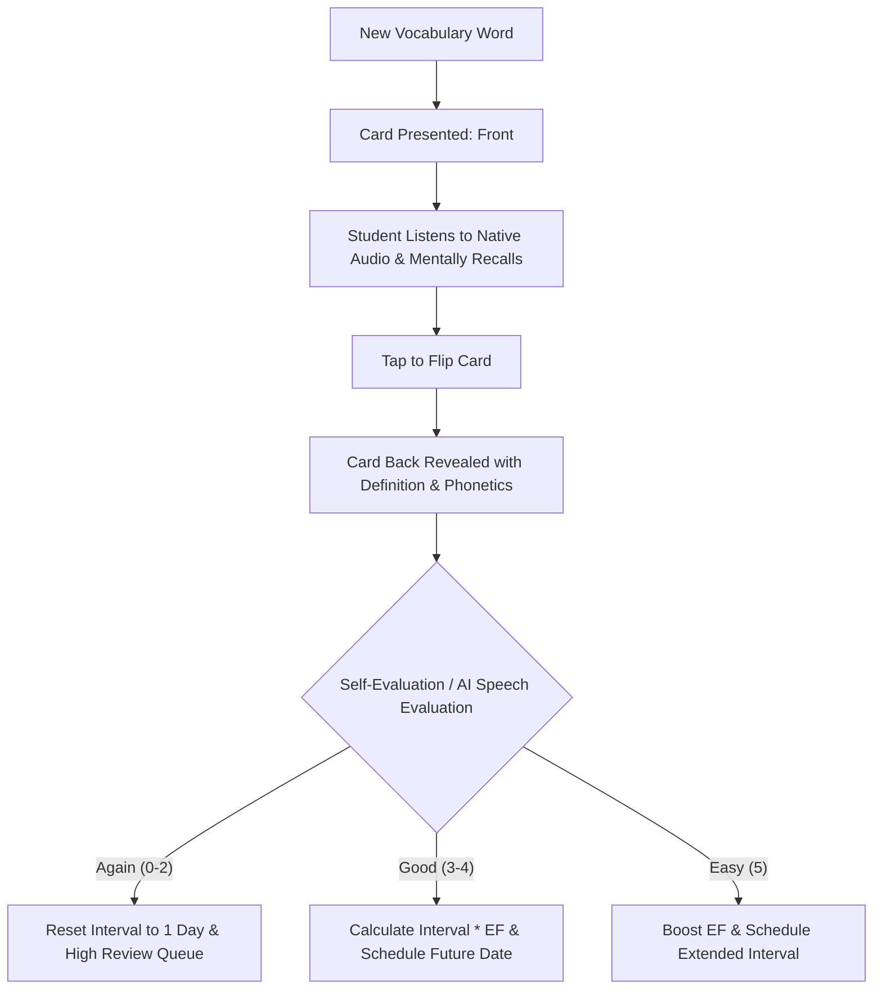

# Prompt 02: Language Learning App 🌍🗣️

> **Official Prompt:** *"Create a structured, user-friendly mobile experience that simplifies the acquisition of a new language through spaced repetition or immersive daily practice. We're looking for a strong grasp of pedagogical design, with a seamless and intuitive user journey."*

---

## 🎯 Executive Summary & Learning Objective

Language learners routinely suffer from the **"Duolingo Plateau"**: accumulating streaks through superficial matching games while failing to achieve conversational confidence or long-term vocabulary retention. 

To win this track, your product must marry **proven cognitive retention algorithms** (such as SuperMemo-2 / Ebbinghaus Forgetting Curve mitigation) with **interactive audio-verbal immersion** and **mobile-first tactile UX**. The user should experience a frictionless habit loop that moves them from vocabulary recognition to active speech production.

---

## 🧠 Pedagogical Framework: Spaced Repetition Systems (SRS)

### 1. The Ebbinghaus Forgetting Curve & The SM-2 Algorithm
Memory traces decay exponentially unless reinforced at calculated intervals. Your app should implement a modified **SuperMemo-2 (SM-2)** algorithm or Leitner 5-Box system to optimize review schedules:

```
I(1) = 1 day
I(2) = 6 days
For n > 2: I(n) = I(n-1) * EF
```
Where:
- **$I(n)$**: Interval in days until next review.
- **$EF$ (Easiness Factor)**: Starts at 2.5. Updated after each review based on user recall grade (0 to 5):
$$EF' = EF + (0.1 - (5 - q) \times (0.08 + (5 - q) \times 0.02))$$
*(Minimum $EF = 1.3$)*



### 2. Active Recall vs. Passive Recognition
- Avoid multiple-choice recognition drills where learners simply eliminate improbable answers.
- Emphasize **cued recall**: Given a target concept, prompt the learner to pronounce or spell the target word before revealing the back.

---

## 📱 Mobile-First UX & Interaction Architecture

### 1. Tactile Swipe & Flip Gestures
- **Card Physics:** 3D perspective flip on click/tap (`transform: rotateY(180deg)`).
- **Tinder-Style Swipe Mechanics:** Swipe right for "Easy / Mastered" (green glow), swipe left for "Again / Hard" (amber glow).
- **One-Hand Ergonomics:** All primary action buttons (audio trigger, flip, grade buttons) positioned within the lower 40% thumb zone.

### 2. Micro-Session Pacing
- Limit review sessions to **3–5 minutes** (10–15 cards) to prevent cognitive overload.
- End-of-session celebration screen summarizing: Words Reviewed, New Words Mastered, Memory Strength Score, and Next Review Countdown.

---

## 🎙️ Speech & Conversational AI Integration

Nerdy's AI Product Engineers will look for state-of-the-art multimodal AI implementation:

### 1. Native Web Speech API & Edge Audio
- **Text-to-Speech (TTS):** Utilize browser-native `window.speechSynthesis` with locale support (`es-ES`, `fr-FR`, `de-DE`, `ja-JP`) for zero-latency audio playback without paid API bottlenecks.
- **Speech-to-Text (STT):** Utilize `webkitSpeechRecognition` to allow users to speak the foreign phrase aloud and grade their phonetic precision.

### 2. AI Conversational Micro-Roleplay
Complement flashcards with an on-demand AI immersion partner simulating real-world dialogues:

```
Scenario: Ordering coffee in Madrid
AI Waiter: "¡Hola! ¿Qué le gustaría tomar hoy?"
Learner (Voice/Text): "Un café con leche, por favor."
AI Feedback Coach: "Perfect! Grammatically accurate and natural. +15 Fluency XP."
```

#### Prompt Engineering for the AI Language Coach:
```markdown
System Prompt:
You are "Tito", a friendly native Spanish conversational partner.
Learner Level: CEFR A2 (Beginner-Intermediate).
Current Scenario: {scenario_name}

Rules:
1. Respond with a short, conversational response in Spanish (under 2 sentences).
2. If the user makes a minor grammatical error, provide a gentle correction in brackets [e.g., Note: use 'la cuenta' instead of 'el cuenta'].
3. Include an English translation in collapsible markdown if requested.
4. Keep the roleplay advancing naturally with an open-ended question.
```

---

## 🛠️ Technical Implementation & Data Schemas

### TypeScript Data Schemas
```typescript
interface Flashcard {
  id: string;
  language: 'es' | 'fr' | 'de' | 'ja';
  term: string;                // e.g. "Desafortunadamente"
  phonetic: string;            // e.g. "deh-sah-for-too-nah-dah-MEN-teh"
  translation: string;         // e.g. "Unfortunately"
  partOfSpeech: 'noun' | 'verb' | 'adjective' | 'adverb';
  exampleSentenceTarget: string;
  exampleSentenceEnglish: string;
  audioUrl?: string;           // Optional pre-rendered native audio
}

interface SRSMetadata {
  cardId: string;
  repetitionNumber: number;   // Count of successful consecutive reviews
  easinessFactor: number;     // Defaults to 2.5
  intervalDays: number;       // Current review interval
  lastReviewedAt: string;     // ISO timestamp
  nextDueDate: string;        // ISO timestamp
  state: 'learning' | 'review' | 'mastered';
}

interface LanguageSessionMetrics {
  userId: string;
  cardsStudiedToday: number;
  streakDays: number;
  averageRecallAccuracy: number;
  pronunciationConfidenceScore: number;
}
```

### Next.js / React Audio Hook Example
```javascript
export function useSpeechSynthesis(locale = 'es-ES') {
  const speak = (text) => {
    if (!('speechSynthesis' in window)) {
      console.warn("Web Speech API not supported in this browser.");
      return;
    }
    window.speechSynthesis.cancel(); // Abort previous utterance
    const utterance = new SpeechSynthesisUtterance(text);
    utterance.lang = locale;
    utterance.rate = 0.9; // Slightly slower for clearer learner comprehension
    window.speechSynthesis.speak(utterance);
  };

  return { speak };
}
```

---

## 🎬 2-to-3 Minute Demo Video Walkthrough Blueprint

| Timestamp | Section | Visual on Screen | Script / Spoken Voiceover |
| :--- | :--- | :--- | :--- |
| **0:00 – 0:30** | **The Hook** | Mobile viewport preview showing sleek dark-mode flashcard deck. | *"Language learners quit because flashcards feel like rote memorization. We built an AI-powered spaced repetition engine with instant speech feedback that fits into a 3-minute morning coffee break."* |
| **0:30 – 1:15** | **The Spaced Repetition Loop** | Click card, hear native pronunciation, flip card, trigger swipe gesture. | *"Watch the UX: high-contrast tactile cards with native Web Speech synthesis. As I grade my recall, our modified SM-2 algorithm dynamically calculates the next review interval."* |
| **1:15 – 2:00** | **AI Speech & Dialogue Immersion** | Switch to the AI Roleplay tab; speak into microphone; show instant AI reply & grammar correction. | *"Now the breakthrough: moving from passive cards to active speech. Watch as I order food in Spanish. The AI transcribes my voice, tests pronunciation, and continues the dialogue in character."* |
| **2:00 – 2:45** | **Architecture & Pedagogical Design** | Quick screen of the SRS math formula and client-side audio pipeline. | *"Built as a mobile PWA using React, Tailwind, and Edge AI. Zero latency audio synthesis with complete offline caching capability."* |
| **2:45 – 3:00** | **Closing** | Final dashboard showing retention curve analytics. | *"A complete pedagogical journey from vocabulary exposure to conversational readiness. Built for the future of Varsity Tutors language instruction."* |

---

## 🏆 Scoring Checklist for Prompt 02

- [ ] **Legitimate Spaced Repetition:** Does the app track interval spacing rather than just cycling a static random array?
- [ ] **Native Audio Integration:** Does the app feature clean, functional audio pronunciation?
- [ ] **Mobile Ergonomics:** Is the UI responsive, touch-friendly, and thumb-accessible?
- [ ] **Conversational Context:** Are vocabulary words grounded in practical, real-world conversational sentences?
- [ ] **Retention Analytics:** Can the user see their memory retention strength or upcoming review load?
