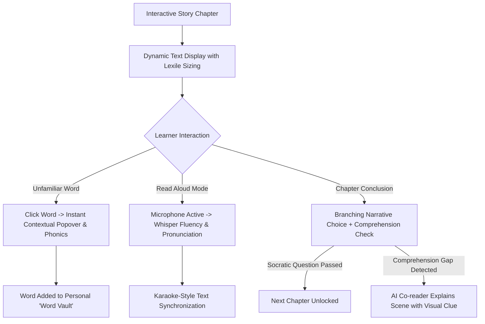

# Prompt 03: English Reading Game 📖✨

> **Official Prompt:** *"Build a literacy-focused application that helps young learners improve reading fluency, comprehension, and vocabulary through interactive storytelling or challenge-based gameplay. We're looking for educational rigor blended with fun, narrative-driven design."*

---

## 🎯 Executive Summary & Learning Objective

Reading is the gateway skill for all academic success, yet millions of elementary and middle school students struggle with reading comprehension, phonics decoding, and vocabulary deficits. Traditional reading comprehension apps present dry passages followed by standardized multiple-choice questions—an experience that turns reading into a chore.

To win this track, your product must transform reading into an **interactive narrative adventure** where the student's choices drive the story, words can be explored on-demand in context, and AI acts as an **empathetic reading coach** that listens to the child read aloud, assesses fluency, and reinforces vocabulary.

---

## 📚 Literacy Pedagogy & Reading Science

### 1. The Science of Reading (Scarborough's Reading Rope)
Skilled reading requires the integration of two distinct domains:
1. **Word Recognition:** Phonological awareness, decoding, and sight recognition.
2. **Language Comprehension:** Background knowledge, vocabulary depth, language structures, and verbal reasoning.

Your app should support both pillars through:
- **Lexile-Calibrated Story Tiers:** Adjusting sentence complexity, syntax length, and Tier 2 vocabulary (academic words like *astonishing, investigate, persistent* vs basic words like *big, look, happy*).
- **In-Context Vocabulary Acquisition:** Research proves that vocabulary is retained 3x better when learned within a compelling narrative context rather than isolated flashcard memorization.



### 2. Bloom's Taxonomy Comprehension Checks
Avoid trivia questions that only test rote recall. Structure story checkpoints using progressive cognitive depth:
- **Remembering:** *"Where did Maya find the ancient key?"*
- **Understanding:** *"Why was Maya hesitant to open the mossy door?"*
- **Applying & Evaluating:** *"If you were in Maya's shoes, which path would you choose to avoid the rising tide?"*

---

## 🎮 Core Interactive Mechanics & Narrative Architecture

### 1. Click-to-Define Contextual Glossaries
- **Zero-Friction Inspection:** Every word in the story is an interactive touch target. 
- Clicking an unfamiliar word instantly opens an unobtrusive tooltip showing:
  1. **Definition tailored to the story context** (not a 10-line dictionary dump).
  2. **Child-friendly example.**
  3. **Phonetic syllable breakdown** (e.g., *mys·ti·fy*).
  4. **Audio pronunciation button**.
- Words inspected are automatically saved to the student's **"Word Vault"** for review mini-games.

### 2. Choose-Your-Own-Adventure Branching Narratives
- Stories are organized as directed graphs (nodes & choices).
- Students make narrative decisions at key dramatic moments (e.g., *"Sneak into the cave"* vs. *"Climb the watchtower"*), which unlocks different vocabulary subsets and plot arcs.

### 3. "Karaoke" Read-Along Synchronization
- As narration plays (or as the student reads aloud), text highlights word-by-word with a glowing underline, reinforcing visual-auditory phoneme pairing.

---

## 🤖 Agentic AI Integration & Story Generation

### 1. Dynamic Story Weaver (Adaptive Difficulty)
Using modern LLMs, your game can generate infinite personalized chapters tailored to the student's personal interests (dinosaurs, space, mysteries) while strictly enforcing target Lexile levels and vocabulary lists:

```markdown
System Prompt:
You are an expert children's author and reading specialist.
Target Age: 8-10 years old (Grade 3-4, Lexile 500L-700L).
Protagonist: Maya the explorer.
Target Vocabulary Words to seamlessly weave into the story: ["perilous", "illuminated", "ancient", "decipher"].
Current Story Node: Maya enters the cavern.

Rules:
1. Write an engaging 120-word chapter.
2. Bold the target vocabulary words.
3. Keep sentence structures varied but readable.
4. Conclude with 2 intriguing choices for the reader.
5. Provide a JSON block at the end with contextual definitions for the target vocabulary words.
```

### 2. Reading Fluency Listener (Speech-to-Text)
- Utilizes browser speech recognition or Whisper API to transcribe the child reading aloud.
- Calculates **Words Correct Per Minute (WCPM)** and flags hesitated or mispronounced words for gentle reinforcement.

---

## 🛠️ Technical Specifications & Data Models

### Interactive Story Node Schema
```typescript
interface WordDefinition {
  word: string;
  phonetic: string;
  contextualDefinition: string;
  syllables: string[];
  audioSampleUrl?: string;
}

interface StoryChoice {
  id: string;
  choiceText: string;
  targetNodeId: string;
  requiredComprehensionQuestionId?: string;
}

interface ComprehensionQuestion {
  id: string;
  question: string;
  bloomLevel: 'recall' | 'inference' | 'synthesis';
  options: string[];
  correctIndex: number;
  explanation: string;
}

interface StoryNode {
  id: string;
  title: string;
  lexileLevel: number;
  chapterNumber: number;
  narrativeText: string; // Tokenized into interactive word spans
  glossary: Record<string, WordDefinition>;
  choices: StoryChoice[];
  comprehensionCheck?: ComprehensionQuestion;
}

interface LearnerWordVault {
  userId: string;
  savedWords: Array<{
    word: string;
    encounteredNodeId: string;
    masteryLevel: 'discovered' | 'practicing' | 'mastered';
    savedAt: string;
  }>;
}
```

### Click-to-Define React Implementation Snippet
```jsx
function InteractiveStoryText({ text, glossary, onWordClick }) {
  const words = text.split(/(\s+)/); // Preserves spacing

  return (
    <div className="leading-relaxed text-xl font-serif text-slate-100 selection:bg-purple-500/30">
      {words.map((chunk, index) => {
        const cleanWord = chunk.trim().replace(/[.,/#!$%^&*;:{}=\-_`~()]/g, "").toLowerCase();
        const hasDefinition = glossary && glossary[cleanWord];

        if (!chunk.trim()) return <span key={index}>{chunk}</span>;

        return (
          <span
            key={index}
            onClick={() => hasDefinition && onWordClick(glossary[cleanWord])}
            className={`cursor-pointer transition-all rounded px-0.5 ${
              hasDefinition 
                ? "border-b-2 border-purple-400 text-purple-200 hover:bg-purple-500/20 font-medium" 
                : "hover:text-purple-300"
            }`}
          >
            {chunk}
          </span>
        );
      })}
    </div>
  );
}
```

---

## 🎬 2-to-3 Minute Demo Video Walkthrough Blueprint

| Timestamp | Section | Visual on Screen | Script / Spoken Voiceover |
| :--- | :--- | :--- | :--- |
| **0:00 – 0:30** | **The Hook** | Rich story UI with dark canvas, glowing typography, and character portrait. | *"Reading comprehension worksheets are broken. We built a narrative literacy game where stories adapt to the reader, every word is interactive, and students learn vocabulary in the context of an epic quest."* |
| **0:30 – 1:15** | **Interactive Inspection & Word Vault** | Read a sentence; click on the word 'illuminated'. Popover appears with phonetics and sound; word auto-saves to Word Vault. | *"Watch: when an unfamiliar word appears, the student simply taps it. Instantly, they get a context-specific definition, syllable breakdown, and audio pronunciation without losing their reading flow."* |
| **1:15 – 2:00** | **Branching Story & Comprehension Challenge** | Choose between two story paths; solve a Bloom's inference question to progress. | *"At the climax of each chapter, the learner makes a story choice. To advance, they answer an inference-based comprehension check. If they need help, the AI co-reader provides a subtle story clue."* |
| **2:00 – 2:45** | **AI Personalization & Vocabulary Vault** | Show the student's Word Vault dashboard and AI chapter generator adjusting Lexile levels. | *"Under the hood, our engine tracks vocabulary mastery and adapts Lexile text difficulty in real-time. Teachers or tutors on Varsity Tutors can monitor comprehension gaps instantly."* |
| **2:45 – 3:00** | **Conclusion** | Summary screen with GitHub repo and live demo link. | *"Bridging the science of reading with the magic of gaming. Ready for production at Nerdy."* |

---

## 🏆 Scoring Checklist for Prompt 03

- [ ] **Contextual Relevance:** Are word definitions tailored to their exact usage in the story rather than generic dictionary strings?
- [ ] **Reader Flow:** Is the click-to-define UI unobtrusive so it doesn't shatter the narrative immersion?
- [ ] **Pedagogical Depth:** Do comprehension questions probe deeper reasoning and cause-and-effect rather than superficial recall?
- [ ] **Delight & Narrative Drive:** Is the story actually enjoyable and suspenseful for a young learner?
- [ ] **Vocabulary Retention Loop:** Is there a tangible mechanism (like a Word Vault) to reinforce words after the chapter concludes?
