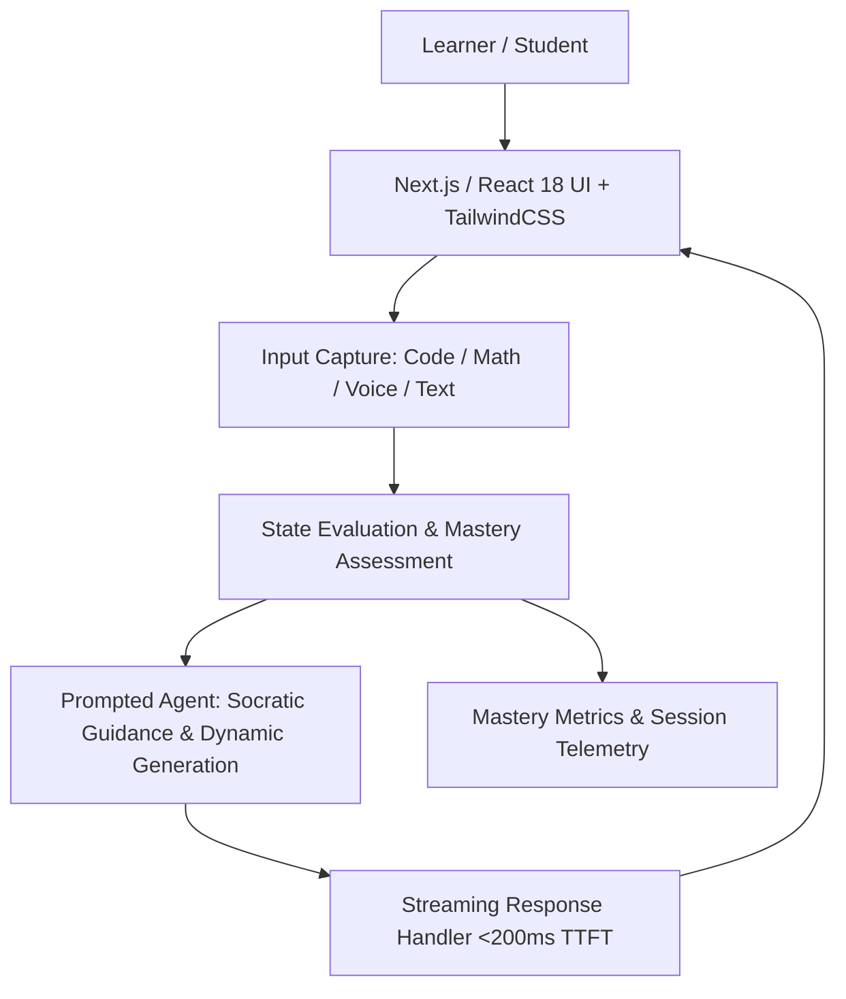

# Prompt 04: Bring Your Own Idea (Open Innovation Track) 💡🚀

> **Official Prompt:** *"The three above are suggestions, not a shortlist. Build whatever you want, so long as it is a tool that genuinely helps someone learn. We're looking for the same rigor we are looking for above—a real learner, a real problem, something you can demo."*

---

## 🎯 Strategic Overview & The Nerdy Context

Choosing the **"Bring Your Own Idea"** track is a bold move that can make your submission stand out dramatically—if executed with extreme discipline. 

Nerdy (NYSE: NRDY) operates **Varsity Tutors**, an ecosystem spanning **3,000+ subjects**, pairing live expert instruction with an AI layer. Nerdy's engineering leadership is constantly looking for tools that solve real bottlenecks in how humans learn and how tutors instruct.

To win with a custom idea, you must clearly articulate:
1. **The Real Learner:** Exactly who is using this tool? (e.g., AP Biology students, adult career-switchers learning Python, ADHD high schoolers preparing for the SAT).
2. **The Real Friction:** What is fundamentally broken or inefficient about how this subject is currently learned?
3. **The AI Superpower:** Why is this product impossible without modern generative or multimodal AI? (If it's just a database with forms, it will not pass review).
4. **The Live Demo:** Can a judge experience the "aha!" moment in under 60 seconds?

---

## 💡 4 High-Impact Idea Blueprints Tailored for Nerdy

Here are four pre-vetted, high-potential concepts designed to impress Nerdy's engineering evaluation panel:

---

### Concept A: AI Socratic Coding Copilot & Visual AST Debugger 💻🔍
* **Target Audience:** High school or college students learning computer science (Python/JavaScript).
* **The Core Problem:** Beginners hit syntax or runtime errors and immediately copy-paste into ChatGPT, getting the direct solution without learning how to debug or think algorithmically.
* **The AI Superpower:**
  - An interactive Monaco code editor connected to an AST (Abstract Syntax Tree) analyzer.
  - When the code crashes, an **AI Socratic Tutor** asks guiding questions about variable scope or boundary conditions rather than rewriting the code.
  - Generates interactive visual memory diagrams (showing variables, stack frames, and array pointers in real time).

---

### Concept B: Adaptive SAT/ACT Diagnostic & Strategy Engine 🎯📊
* **Target Audience:** High school students preparing for college admissions exams.
* **The Core Problem:** SAT prep books and static question banks fail to diagnose the root cause of missed questions (e.g., time-management panic vs. mathematical formula gaps vs. trap-answer vulnerability).
* **The AI Superpower:**
  - Real-time question recommendation based on Bayesian Knowledge Tracing.
  - Distractor Analysis: AI analyzes *why* the student picked Choice (C) instead of (B) and pinpoints the specific college board trap they fell into.
  - Micro-strategy drills: 60-second rapid-fire elimination challenges.

---

### Concept C: Multi-Modal Interactive Science Lab Simulator 🔬🧪
* **Target Audience:** Middle & High School Chemistry / Physics students.
* **The Core Problem:** Most schools lack well-equipped physical laboratories, and static textbook diagrams fail to build intuition around reaction kinetics, thermodynamics, or circuits.
* **The AI Superpower:**
  - Interactive virtual workbench (mix chemicals, adjust voltages, alter gravity).
  - AI Lab Partner: Acts as the lab safety supervisor and scientist guide, predicting reaction outcomes, generating procedural checklists, and prompting the student to formulate testable hypotheses before conducting trials.

---

### Concept D: Neurodivergent Executive Function & Study Copilot 🧠⚡
* **Target Audience:** Students with ADHD, executive dysfunction, or study anxiety.
* **The Core Problem:** Overwhelmed students face task paralysis when looking at massive study guides, syllabi, or multi-chapter readings.
* **The AI Superpower:**
  - **Syllabus-to-Sprint AI:** Paste a dense exam rubric, and the AI automatically atomizes it into 15-minute gamified micro-tasks.
  - **Dopamine-Paced Workflows:** Combines Pomodoro timers with adaptive flashcard sprints, instant visual checkoffs, and audio biofeedback/ambient focus soundscapes.

---

## 🏗️ Universal Product Architecture for Custom Submissions

Regardless of your chosen domain, structure your application around this clean architectural pipeline:

### Essential Technical Capabilities to Include:
1. **Streaming Responses:** Use server-sent events (SSE) or Vercel AI SDK to stream hints and feedback character-by-character. Nobody wants to wait 5 seconds staring at a loading spinner.
2. **State Persistence:** Store learner session telemetry in `localStorage` or PostgreSQL so refreshing the page preserves their progress.
3. **Graceful Fallbacks:** If an external LLM API rate limits or errors, provide structured fallback responses so the demo never crashes on live presentation.

---

## 🎬 2-to-3 Minute Demo Video Blueprint for Custom Ideas

| Timestamp | Section | Visual on Screen | Script / Spoken Voiceover |
| :--- | :--- | :--- | :--- |
| **0:00 – 0:30** | **The Learner & The Friction** | Show the problem in the wild (e.g., student staring at an intimidating Python error or SAT trap question). | *"Meet Alex. Alex is trying to learn computer science, but every time code fails, standard AI tools just give him the answer, destroying his learning retention. Here's our solution: CodeMentor AI."* |
| **0:30 – 1:30** | **The Core Product Experience** | Live interaction with your tool. Demonstrate the main feature working seamlessly. | *"Watch this: Alex types buggy code. Rather than fixing it, our Socratic engine analyzes the AST and asks: 'Look at line 4—what value does `i` have when the loop terminates?'"* |
| **1:30 – 2:15** | **The AI Superpower** | Highlight what makes your AI integration unique (e.g., visual memory diagram generation, error taxonomy). | *"Notice what happens next: the AI renders a live visual stack diagram. This transforms an abstract cognitive concept into an intuitive visual map."* |
| **2:15 – 2:45** | **Technical Architecture** | Quick architecture overview, latency numbers, and tech stack. | *"Under the hood, we built this with Next.js, WebAssembly execution, and edge streaming LLMs, keeping interaction latency under 200 milliseconds."* |
| **2:45 – 3:00** | **The Nerdy Fit** | Final takeaway tying the project to Nerdy's mission. | *"This directly addresses how millions of students learn on Varsity Tutors. Thank you!"* |

---

## 🏆 Scoring Rubric for the Open Track

- [ ] **Problem Urgency:** Is the educational problem authentic, painful, and widely experienced?
- [ ] **Pedagogical Integrity:** Does the app cultivate genuine understanding, or does it encourage shortcuts?
- [ ] **Production Quality:** Does the app feel like a real product rather than an unstyled weekend hack?
- [ ] **AI-Native Differentiation:** Does generative or multimodal AI provide the foundational engine of the product?
- [ ] **Clear Demo Flow:** Can anyone understand the value within 30 seconds of launching the app?
