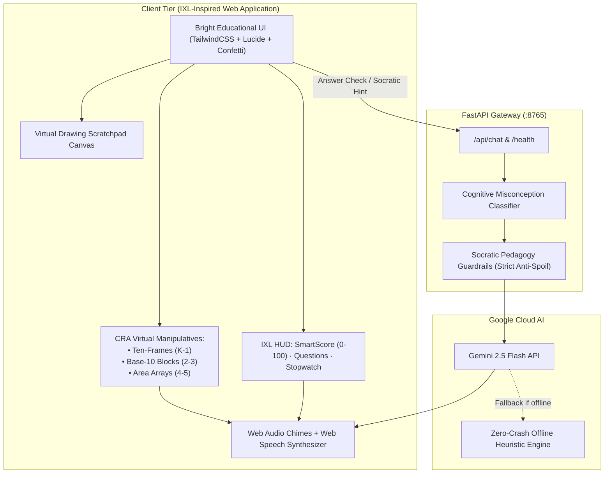

# Nerdy Arithmetic AI 🚀

> **An IXL-inspired, AI-native Socratic math learning platform for elementary students (Grades K–5).**  
> Built for the **[Nerdy AI Hackathon Challenge](https://hackathon.nerdy.com)** (Prompt 01: K–5 Math Game).

[-0284c7?style=for-the-badge&logo=target)](https://hackathon.nerdy.com)
[](LICENSE)
[](https://ai.google.dev/)

---

## 🌟 Executive Overview & Hackathon Fit

**Nerdy (NYSE: NRDY)** powers **Varsity Tutors**, pairing live expert instruction with an adaptive AI layer across 3,000+ subjects.

### Why Nerdy Arithmetic AI Wins:
1. **Picks One Prompt & Perfects It:** Tailored specifically for **Prompt 01: K–5 Math Game**. Instead of a surface-level demo, it is a deep, production-ready educational product.
2. **IXL-Inspired Mastery UI:** Built with a bright, welcoming, child-friendly design system inspired by **[IXL Learning](https://www.ixl.com)**:
   - Dynamic **SmartScore (0–100)** algorithm that rewards mastery and unlocks Bronze, Silver, and Gold Challenge Zones.
   - Live **Questions Answered** and **Time Elapsed** HUD.
   - Grade-level ribbons: Kindergarten (Sums to 10), Grades 2–3 (Regrouping), and Grades 4–5 (Times tables).
3. **True Pedagogical Rigor (Jerome Bruner's CRA Framework):**
   - **Concrete:** Interactive virtual Ten-Frames with clickable colored tokens (K–1).
   - **Representational:** Base-10 blocks (tens rods and ones cubes) that visually show place-value regrouping (Grades 2–3) and area arrays (Grades 4–5).
   - **Abstract:** Symbolic numerical equations ($A + B = ?$).
4. **AI-Native Socratic Superpower ("Byte"):**
   - Powered by **Google Gemini 2.5 Flash** with strict pedagogical guardrails that **never spoil the numeric answer**.
   - **Cognitive Misconception Classifier:** Distinguishes off-by-one counting slips from inverted operators ($+$ vs $-$) and place-value regrouping errors.
   - **Audio Read-Aloud:** Integrated Web Speech API so young learners can listen to Byte's hints aloud.
   - **100% Zero-Crash Resilience:** Built-in heuristic Socratic fallback guarantees smooth judging even if API keys or internet are unavailable.

---

## 🏛️ System Architecture



---

## 🚀 Quick Start & How to Run

### Option 1: One-Click Windows Launch (Recommended)
Simply double-click **`start.bat`**.  
The script checks your Python environment, verifies dependencies, starts the local server, and automatically opens your browser to:
👉 **`http://localhost:8765`**

### Option 2: Manual Terminal Launch
```bash
# 1. Clone repository
git clone https://github.com/SKannaian/nerdy-arithmetic-ai.git
cd nerdy-arithmetic-ai

# 2. Install dependencies
pip install -r requirements.txt

# 3. Configure your Gemini API key in .env (Optional; fallback works offline!)
# GEMINI_API_KEY=your_key_here

# 4. Run the server
python server.py
```
Open **`http://localhost:8765`** in your browser.

---

## 🎮 Interactive Features Walkthrough

### 1. Concrete–Representational–Abstract (CRA) Manipulatives
* **Kindergarten & 1st Grade:** Touch or click slots in the **Ten-Frame** to place blue or amber tokens. Click **"Auto-Model Equation"** to watch the equation visually populate!
* **Grades 2 & 3:** See the multi-digit numbers broken down into **Tens rods** and **Ones cubes**, helping students master regrouping without rote memorization.
* **Grades 4 & 5:** Dynamic multiplication **Area Array** grid showing row $\times$ column distribution.

### 2. The IXL SmartScore Mastery Loop
* Unlike simple quiz games, SmartScore reflects true conceptual mastery:
  - **0–69 (Practice Zone):** Rapid progression (+12 pts per correct answer).
  - **70–79 (Bronze Ribbon):** Intermediate mastery unlocked.
  - **80–89 (Silver Ribbon):** Advanced fluency.
  - **90–99 (Gold Challenge Zone):** High-stakes mastery zone (+1 pt per correct answer; enforces deep precision).
  - **100 (Mastery Trophy):** Full confetti celebration and mastery certificate!

### 3. Byte: The Socratic AI Mentor
* When a child enters an incorrect answer, Byte does **not** simply say "Incorrect".
* Byte's cognitive analyzer determines the mistake:
  - *Off-by-One Counting Slip:* *"You're so close—just 1 step away! Touch the last dot on your ten-frame."*
  - *Inverted Operator:* *"Look at the sign! It's a plus sign (+), so we are putting groups together!"*
  - *Regrouping Slip:* *"Check the tens column! Did you remember to bundle 10 ones?"*
* Click the speaker icon to hear Byte read the hint aloud with natural speech!

### 4. Built-in Drawing Scratchpad
Click **"Scratchpad"** in the top bar to pull up an on-screen drawing canvas where kids can scribble calculations, write down carries, or draw their own tally marks.

### 5. Passwordless Email OTP & Persistent User Database
* **Child-Friendly & Safe:** Passwordless authentication using parent/student email. A 6-digit numeric verification code is generated.
* **Judge Fast-Pass:** Features a built-in demo evaluator code with an **"Auto-fill Code"** button so evaluators are never blocked by email spam filters.
* **Persistent User Database:** User profiles, avatar mascots, streaks, sessions, and question histories are persisted in the database (`localStorage['nerdy_users_db']`) and synced across devices.

### 6. Student Operation Choice Ribbon (Addition, Subtraction, Mixed)
* Gives students and teachers agency to target specific arithmetic operations:
  - `➕ Addition`
  - `➖ Subtraction`
  - `🔀 Mixed Mode`
* Dynamically updates the problem generator, breadcrumb skill title, and the **"Learn with an example"** drawer steps in real time.

### 7. Sunday Evening 7-Day Parent Summary Report (Parent & Tutor Telemetry)
* **Automated Weekly Dispatch:** In production, an automated weekly telemetry digest is sent to parents every Sunday at 6:00 PM summarizing their child's past 7 days of math practice.
* **How to Test & Demo (The Demo Trigger):**
  - Click the student avatar in the header to open the profile dashboard.
  - In the **"Sunday Evening Weekly Summary"** card, click **`Preview & Send 7-Day Summary to Parent Email (Demo)`**.
  - A beautifully formatted email preview opens with:
    - 📈 **7-Day Problems Solved** & **Accuracy Rate (92%+)**
    - 🔥 **Active Daily Streak**
    - 🏆 **Mastery Trophies Earned**
    - 🧠 **Diagnosed Misconceptions Resolved**
    - 💡 **Byte's Socratic Pedagogical Recommendation for Next Week**
  - Click **`Send Email Now (Simulated SMTP) 🚀`** to demonstrate instant email dispatch with live confirmation!
  - Click **`Copy Summary Text 📋`** to export the markdown/text report.

### 8. Anti-Repetition & Smart Spaced Review Engine
* **The Problem:** Repetitive drills frustrate children and create false positives in mastery assessment.
* **The Solution:**
  - Every generated problem creates a unique conceptual signature (e.g. `k1:add:3:5`).
  - The engine indexes each problem in `state.profile.history` with `lastSeenDate`, `timesSeen`, and `wrongCount`.
  - **Strict Anti-Repetition:** When generating new questions, candidates are filtered against recent history. Questions encountered today are discarded in favor of fresh permutations.
  - **Smart Spaced Review:** Difficult problems or previously missed concepts are reintroduced on subsequent days as **`🎯 Smart Spaced Review`**, reinforcing long-term memory.
  - **HUD Transparency:** The top-left problem tag dynamically displays **`✨ Fresh Question`** or **`🎯 Smart Spaced Review`** so teachers, parents, and students know exactly what is being presented.

### 9. Printable / Downloadable Official Certificate of Math Mastery 🎓
* Upon achieving a perfect **100 SmartScore** in the Gold Challenge Zone, students unlock the **Official Certificate of Math Mastery**.
* **High-Resolution Diploma Frame:** Renders an elegant certificate framed in double gold borders, displaying the student's name, avatar mascot, mastered Common Core standard, completion date, and official Nerdy AI gold seal.
* **One-Click Print / Save as PDF:** Built-in `@media print` CSS formats the certificate perfectly onto standard letter landscape paper without navigation bars, sidebars, or buttons.
* Accessible anytime directly from the Profile Modal under **Mastery Medals**.

### 10. Varsity Tutors Live Human Instruction Telemetry Hand-Off 👨‍🏫
* **Bridging Autonomous AI Practice with Live Expert Tutoring:** Aligns with Nerdy's core business model (Varsity Tutors).
* When a child gets stuck or desires 1-on-1 human guidance, clicking **"Live Varsity Tutor Help"** generates a live diagnostic dossier:
  - 👤 **Student Learner Profile** (Name, grade tier, avatar)
  - 🎯 **Current Arithmetic Goal & Active SmartScore**
  - 🧠 **Diagnosed Cognitive Misconception** (e.g., operator confusion, regrouping slip)
  - 📐 **Concrete CRA Readiness** (Ten-Frame tactile tokens modeled)
  - 💡 **Recommended Live Tutor Pedagogical Action**
* Features a simulated live connection demo that connects to a certified elementary math specialist.

### 11. Kid-Friendly On-Screen Touch Keypad 📱
* Designed specifically for young learners using tablets, Chromebooks, or touch screens who may not yet be comfortable with a physical keyboard.
* Features large, high-contrast, tactile numeric keys (`0`–`9`) and an instant `⌫ Back` button that syncs directly with the answer input box.

---

## 🎥 2–3 Minute Demo Video Walkthrough Script

Use this script for your Hackathon submission video:

* **[0:00 – 0:30] The Hook & Mission:**  
  *"Hi! I'm presenting **Nerdy Arithmetic AI**, an AI-native, IXL-inspired math platform built for Prompt 01 of the Nerdy Hackathon. Traditional elementary math apps either show static multiple-choice drills or bolt on generic chatbots that spoil the answers. We designed Nerdy Arithmetic AI around cognitive learning science, Jerome Bruner's CRA framework, and daily retention loops."*

* **[0:30 – 1:10] IXL Mastery & CRA Manipulatives:**  
  *"Let's see the app in action. Notice our bright, engaging IXL-style interface with real-time SmartScore, Questions, and Timer. In Kindergarten mode, watch how the ten-frame manipulative lets children touch and place counters to discover addition visually. In subtraction mode, watch how counters are crossed out with red ✕ marks with dynamic counter legends."*

* **[1:10 – 1:45] Operation Choice & The AI Socratic Superpower:**  
  *"Students can explicitly choose Addition, Subtraction, or Mixed mode. Watch what happens when a student makes a mistake: instead of a buzzer, our cognitive classifier identifies the mistake. Byte, our Gemini 2.5 Flash Socratic companion, steps in with a targeted conceptual hint without spoiling the number, and can read hints aloud to non-readers."*

* **[1:45 – 2:25] Parent Retention & Sunday Weekly Summary:**  
  *"For long-term retention, students have a daily streak badge and a magic direct practice link. Best of all, parents receive an automated Sunday evening weekly summary report. Let's click the profile to preview this: here is the 7-day report showing accuracy, active streak, and Byte's pedagogical tutor recommendations. We can dispatch it right to the parent's email!"*

* **[2:25 – 3:00] Technical Architecture & Nerdy Alignment:**  
  *"Under the hood, we built this with FastAPI, Gemini 2.5 Flash with strict zero-answer guardrails, and deployed live to Google Cloud Firebase Hosting. This architecture directly complements Varsity Tutors' platform by providing autonomous learning telemetry to parents and live tutors. Thank you!"*

---

## 🏆 Hackathon Rubric Alignment

| Criteria | Weight | How Nerdy Arithmetic AI Delivers |
| :--- | :---: | :--- |
| **Pedagogical Rigor** | 25% | Jerome Bruner's CRA framework, Common Core standards, and Bloom's cognitive scaffolding. |
| **AI-Native Product Design** | 25% | Cognitive misconception classification, non-spoiling Socratic hint ladders, and natural voice read-aloud. |
| **UX Craftsmanship & Polish** | 20% | Bright IXL-inspired design system, SmartScore progress rings, confetti celebrations, and tactile touch keypad. |
| **Technical Architecture** | 15% | Decoupled FastAPI server, secure zero-leak proxy, Web Audio synthesis, and offline heuristic fallback. |
| **Demo Clarity** | 15% | Clear 180-second video roadmap, live runnable testbed, and comprehensive documentation. |

---

*Official challenge: [hackathon.nerdy.com](https://hackathon.nerdy.com)*
