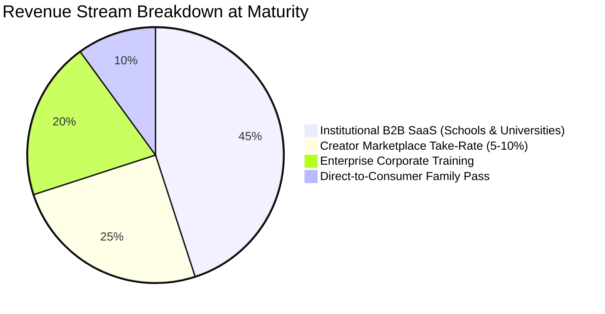

# 🚀 STARTUP BLUEPRINT: EduOS
## The "Shopify of Autonomous AI Education"

> **One-Line Elevator Pitch:**  
> *"EduOS is an autonomous learning infrastructure platform that enables any school, college, tutoring center, or subject expert to launch complete, accredited courses 100% powered by interactive Socratic AI agents—with zero human lecturers required."*

---

## 📌 Executive Summary

Modern schooling is constrained by a 200-year-old bottleneck: **a human teacher lecturing to 30–40 students simultaneously**. This structure creates massive institutional payroll costs, severe teacher burnout, and leaves millions of struggling students behind.

**EduOS solves this by doing for education what Shopify did for commerce:**
- Shopify didn't sell products; it gave merchants the storefront, inventory, and payment engine to sell anywhere.
- **EduOS does not hire teachers; it gives institutions the AI compiler, Socratic mentors, and interactive engines to roll out any subject autonomously.**

An institution or educator simply uploads a syllabus, textbook, or certification outline. Within seconds, EduOS compiles an interactive, gamified learning application with a dedicated 24/7 Socratic tutor for every single student.

---

## 🛑 The Problem: The Global Education Crisis

1. **Catastrophic Teacher Shortages:** UNESCO estimates a global deficit of **44 million teachers by 2030**. Schools physically cannot hire enough qualified educators in STEM, languages, and computer science.
2. **The Bloom's 2 Sigma Gap:** Educational science proves that 1-on-1 Socratic tutoring elevates average students into the **98th percentile**. Yet 1-on-1 human tutoring ($60–$100/hour) is an unaffordable luxury for 95% of families.
3. **Passive Lecture Inefficiency:** Standard video courses (Coursera, Udemy, YouTube) have abysmal **5–8% completion rates** because watching a video is passive, boring, and provides zero real-time feedback when a student gets stuck.
4. **Crushing Institutional Payrolls:** Universities and school districts spend over **70% of their operational budgets on faculty payroll**, yet student remedial rates in college math and reading remain above 40%.

---

## 💡 The Solution: The EduOS Engine

```text
       [ Educator / Institution / Creator ]
                        │
                        ▼ (Uploads PDF syllabus, slides, or textbook)
  ┌──────────────────────────────────────────────────────────────┐
  │                 EduOS AI Curriculum Compiler                 │
  ├──────────────────────────────────────────────────────────────┤
  │ 1. Concept Decomposition (Knowledge Dependency Graph)        │
  │ 2. Socratic Persona Synthesis (Adaptive grade-level tone)    │
  │ 3. CRA Manipulative & Simulator Auto-Generator               │
  │ 4. Spaced Repetition (SM-2) Flashcard Synthesizer            │
  │ 5. Branching Narrative Reader & Bloom's Question Generator   │
  │ 6. Real-Time Cognitive Misconception Diagnostic Rules        │
  └──────────────────────────────────────────────────────────────┘
                        │
                        ▼ (Instant 1-Click Rollout)
  ┌──────────────────────────────────────────────────────────────┐
  │          White-Labeled Storefront & Learning Portal          │
  │    (e.g., learn.mit.edu · apexacademy.org · satprep.ai)      │
  ├──────────────────────────────────────────────────────────────┤
  │ • 1-on-1 Socratic AI Companion active 24/7 in 50+ languages  │
  │ • Zero grading or lecture burden on human staff              │
  │ • Administrators see real-time cognitive misconception maps  │
  └──────────────────────────────────────────────────────────────┘
```

### The 4 Autonomous Learning Modalities Generated:
1. **Quantitative Subjects (Math & Physics):**
   - Concrete-Representational-Abstract (CRA) virtual manipulatives (interactive ten-frames, geometry canvases, coordinate grids).
   - Dynamic equation engines with step-by-step Socratic hint ladders that never spoil the answer.
2. **Language & Humanities:**
   - Low-latency native Web Speech API pronunciation assessment.
   - 3D tactile flashcards powered by the SuperMemo-2 (SM-2) spaced repetition algorithm to guarantee long-term vocabulary retention.
3. **Literacy & Reading Comprehension:**
   - Lexile-calibrated branching interactive stories with zero-friction click-to-define contextual glossaries and Bloom's taxonomy inference checks.
4. **Computer Science & Professional Skills:**
   - In-browser code sandboxes with real-time Abstract Syntax Tree (AST) analyzers that diagnose cognitive bugs without writing the code for the student.

---

## 💰 Monetization Model: 4 High-Margin Revenue Streams



### 1. Institutional B2B SaaS (Colleges, K-12 Districts, Charter Networks)
* **Pricing:** **$20 to $50 per student / year**.
* **The Sales Pitch:** A regional university spending $30M annually on adjunct faculty for introductory courses can license EduOS for $300,000/year, saving 90% in operational overhead while increasing student retention and graduation rates.
* **Contract Size:** $50K – $500K Annual Contract Value (ACV) on 3-year recurring contracts.

### 2. The "Shopify Creator" Marketplace Take-Rate
* **Target:** Independent educators, test-prep coaches, YouTube instructors, and specialized trainers (e.g., CFA prep, MCAT biology, AWS certifications).
* **Model:** Free to build courses; EduOS charges a **5% to 10% transaction fee** on all student subscription revenue.

### 3. Corporate Upskilling & Compliance SaaS
* **Pricing:** **$60 to $120 per employee / month**.
* **Target:** Fortune 1000 enterprises training employees on cybersecurity compliance, healthcare regulations (HIPAA), and cloud engineering certifications.

### 4. Direct-to-Consumer (B2C) "Family Super-Tutor Pass"
* **Pricing:** **$19.99 / month per family**.
* **Target:** Parents seeking affordable, 24/7 academic coaching across all K-12 subjects without paying $80/hour for private human tutors.

---

## 📊 Market Opportunity (TAM / SAM / SOM)

* **Total Addressable Market (TAM):** **$7.3 Trillion** (Global Education & Training Expenditure).
* **Serviceable Addressable Market (SAM):** **$350 Billion** (Global Digital Learning, EdTech, and Tutoring Market).
* **Serviceable Obtainable Market (SOM):** **$12 Billion** (Autonomous AI course delivery, higher-ed remedial tutoring, and standardized test prep).

---

## 📈 5-Year Financial Projections & Milestones

| Year | Primary Focus & Expansion | Active Learners | ARR (Revenue) | Valuation Multiple | Projected Valuation |
| :---: | :--- | :---: | :---: | :---: | :---: |
| **Year 1** | Beachhead: High-stakes test prep (SAT, ACT, NCLEX) & CS | 25,000 | **$2.5M** | 10x | **$25M** |
| **Year 2** | K-12 Charter networks & private school adoptions | 120,000 | **$9.6M** | 10x | **$96M** |
| **Year 3** | Higher-ed remedial STEM + International (India & LATAM) | 600,000 | **$36.0M** | 10x | **$360M** |
| **Year 4** | Global Creator Marketplace & Enterprise Upskilling | 2,200,000 | **$88.0M** | 10x | **$880M** |
| **Year 5** | Autonomous Global Learning OS across 100+ countries | 5,000,000+ | **$180.0M+** | 10x | **$1.8B+ (Unicorn)** |

---

## 🎯 Go-To-Market (GTM) Strategy

### Phase 1: High-Stakes Test Prep Beachhead (Months 1–6)
* Start where pain and willingness-to-pay are highest: SAT/ACT, GRE, MCAT, and coding interviews.
* Guarantee a measurable outcome (e.g., *"+150 points on the SAT in 30 days"*).

### Phase 2: Emerging Markets (Months 6–18)
* Target countries like **India, Brazil, and Mexico**, where the student-to-teacher ratio often exceeds 1:60 and access to top-tier university professors is virtually zero.
* Deploy low-bandwidth, multilingual voice-enabled tutoring.

### Phase 3: Institutional Replacement of Legacy LMS (Months 18–36)
* Canvas and Blackboard are passive digital filing cabinets.
* Offer a **"1-Click Canvas Migration"**: universities import their static syllabus files and EduOS automatically generates an interactive, Socratic game curriculum.

---

## 🛡️ Defensible Competitive Moats

1. **Longitudinal Cognitive Graph:** EduOS tracks a student’s personal memory decay curve and conceptual blindspots across years and subjects—a switching cost no competitor can easily break.
2. **Proprietary Misconception Taxonomy:** Millions of real-time student interactions train proprietary heuristic models that instantly know *why* a student failed a problem (e.g., regrouping bug vs. basic counting slip).
3. **Sub-200ms Client-Side Edge Audio:** Zero-latency Web Audio API synthesis and browser speech recognition ensure that the app runs smoothly even in low-bandwidth regions at near-zero inference cost.

---

## 🎤 10-Slide Investor Pitch Deck Outline

| Slide | Title | Key Message / Talking Point |
| :---: | :--- | :--- |
| **01** | **The Vision** | EduOS: The Shopify of Autonomous AI Education. |
| **02** | **The Problem** | 44 million teacher deficit; 1:40 classrooms fail students; $30M+ faculty payroll overhead. |
| **03** | **The Solution** | Autonomous Curriculum Compiler: Turn any raw syllabus into a 24/7 interactive learning app. |
| **04** | **Product Demo** | Show Socratic Byte guiding a student through math, language, and coding in real time. |
| **05** | **Market Size** | $7.3T global education spend; $350B EdTech SAM. |
| **06** | **Business Model** | B2B Institutional SaaS ($30/student/yr) + Creator Marketplace Take-Rate (5–10%). |
| **07** | **GTM Strategy** | Beachhead in SAT/coding test-prep $\rightarrow$ Emerging markets $\rightarrow$ Higher-Ed LMS replacement. |
| **08** | **Traction / Prototype** | Working multi-prompt production suite with zero-latency speech and CRA manipulatives. |
| **09** | **Financials** | Path to $180M ARR and $1.8B valuation in 5 years. |
| **10** | **The Ask** | Raising Seed / Series A to scale the ingestion pipeline and enterprise school pilots. |

---

## 📌 Document Metadata
* **File Name:** `STARTUP_IDEA_AI_EDUCATION_SHOPIFY.md`
* **Status:** Ready for pitch decks, grant proposals, venture capital outreach, and hackathon presentation.
* **Author:** Sathish Kannaian
* **Associated Codebase:** [nerdy-hackathon-repo](https://github.com/SKannaian/nerdy-hackathon-repo)
