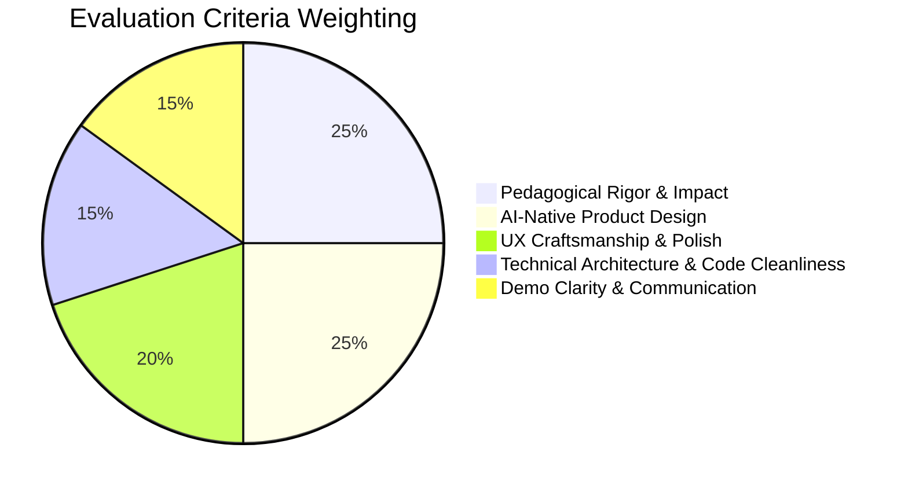

# Nerdy AI Hackathon: Submission & Demo Day Playbook 🏆🚀

> **A comprehensive playbook to turn your build into a winning submission, win up to $10,000 cash, and secure an interview for a $200K+ AI Product Engineer role at Nerdy.**

---

## 📋 The Official Submission Checklist

Submissions officially close **Friday, September 18, 2026 at 11:59 PM CDT**.

To qualify for evaluation by Nerdy's engineering panel, your submission on [hackathon.nerdy.com](https://hackathon.nerdy.com) must include the following four core elements:

| Component | Status | Description & Guidelines |
| :--- | :---: | :--- |
| **1. Your Name & Email** | Required | Ensure your contact info matches your primary GitHub / LinkedIn profile. |
| **2. "What Did You Build?"** | Required | A concise narrative (up to 5,000 characters) explaining: <br>• **What it does** <br>• **How you built it** <br>• **What you would do next with more time** |
| **3. Demo Video Link** | Required | **2 to 3 minutes maximum**. Hosted on Loom, YouTube (Unlisted), Vimeo, or Google Drive, or uploaded directly as MP4/WebM. |
| **4. Code Repository URL** | Highly Recommended | Public GitHub repository link with clean commit history, architecture notes, and local setup steps. |
| **5. Live Demo URL** | Highly Recommended | Deployed, publicly accessible web app link (e.g., Vercel, Netlify, Cloudflare Pages). |

---

## 🎥 The 2–3 Minute Demo Video Playbook

The demo video is **the single most critical asset** in your submission. Nerdy engineering leaders will watch your video first before deciding whether to inspect your source code or invite you to Demo Day.

### Golden Rules of Hackathon Demos
1. **Never spend more than 20 seconds on slides:** Jump straight into the live, running software.
2. **Show, Don't Just Tell:** Demonstrate the user journey by clicking, typing, and speaking into the app.
3. **Highlight the AI Layer:** Clearly explain what the AI is doing behind the scenes (prompting, adaptation, evaluation, speech).
4. **Keep it under 3:00:** Submissions exceeding 3 minutes risk being penalized or skipped.

### Universal 180-Second Video Script Template

```
[0:00 - 0:25] THE HOOK & THE LEARNER
"Hi, I'm [Your Name], and this is [Project Name]. In traditional [math / language / reading / coding] education, learners struggle with [specific friction, e.g., passive memorization / math anxiety / lack of personalized feedback]. We built [Project Name] to solve this using an adaptive, AI-first learning loop."

[0:25 - 1:15] CORE PRODUCT WALKTHROUGH
"Let's look at the product in action. [Share screen showing the live app].
Here, a student enters the experience. Watch how intuitive the interface is... [Demonstrate 1-2 core interactions, e.g., answering a question, flipping a flashcard, clicking an unfamiliar word]. 
Notice the tactile animations and instant visual feedback that keeps the student in a flow state."

[1:15 - 2:00] THE AI SUPERPOWER (THE "WOW" MOMENT)
"Now, here is where AI transforms the experience. [Intentionally trigger a common error or advanced feature].
Instead of a generic 'Incorrect' buzzer, our Socratic AI agent analyzes the student's cognitive mistake in real-time. Watch as it generates a contextual scaffold... [Show the AI hint, speech synthesis, or adaptive recommendation working live]."

[2:00 - 2:35] TECHNICAL ARCHITECTURE & RIGOR
"Under the hood, we built this with [mention tech stack: Next.js 14, TypeScript, TailwindCSS, Edge AI streaming, Web Speech API].
We prioritized sub-200ms latency so the student never experiences jarring wait times. Our state engine tracks student mastery using [mention algorithm: SM-2 spaced repetition / Item Response Theory / Bloom's taxonomy taxonomy]."

[2:35 - 3:00] THE NERDY FIT & FUTURE VISION
"With more time, our roadmap includes integrating live tutor co-pilot telemetry directly into Varsity Tutors' platform. 
Thanks for watching, and I look forward to presenting on Demo Day!"
```

---

## 📝 Crafting the "What Did You Build?" Narrative

Use this structured 3-part template in the submission form text box:

```markdown
### 1. What It Does
[Project Name] is an AI-powered [math / language / literacy / learning] tool designed for [target audience]. It replaces static worksheets with an interactive, gamified journey featuring [Feature A, e.g., adaptive difficulty scaling], [Feature B, e.g., real-time Socratic hints], and [Feature C, e.g., voice-enabled fluency coaching].

### 2. How It Was Built
- Frontend: Built with Next.js 14, React 18, and TailwindCSS for responsive, accessible, mobile-first design.
- Game Mechanics: Custom state engine with streak multipliers, reward loops, and progressive milestone unlocks.
- AI & Audio: Integrated streaming LLMs for microsecond Socratic hint generation, coupled with browser-native Web Speech API for low-latency voice synthesis and recognition.
- Pedagogy: Grounded in [Common Core / Scarborough's Reading Rope / SuperMemo-2 spaced repetition].

### 3. What We Would Build Next
- Integration with Varsity Tutors' Live Session intelligence layer to alert human tutors when students hit recurring roadblocks.
- Longitudinal memory graph tracking cross-session knowledge decay and retention.
- Multi-student collaborative challenges and peer leaderboards.
```

---

## 🚀 Free 5-Minute Deployment Guide

Having a live URL sets your submission apart from candidates who only submit a local repo. Here is how to deploy for free in under 5 minutes:

### Option A: Vercel (Recommended for Next.js / React)
1. Push your repository to GitHub: `git push origin main`
2. Go to [vercel.com](https://vercel.com) and log in with GitHub.
3. Click **Add New Project** $\rightarrow$ Select `nerdy-hackathon-repo`.
4. If using API keys (e.g. OpenAI / Anthropic / Gemini), add them under **Environment Variables**.
5. Click **Deploy**. You will receive an instant production URL (e.g., `https://your-project.vercel.app`).

### Option B: Cloudflare Pages / Netlify (Recommended for Static / Single-Page Apps)
1. For single-page apps (like `nerdy_hackathon_readme.html`), drag-and-drop the directory into [app.netlify.com/drop](https://app.netlify.com/drop).
2. Instant live HTTPS URL generated in 10 seconds.

---

## 🧑‍⚖️ How Nerdy Evaluates Submissions

The judging panel consists of **Nerdy’s executive and engineering leaders**. They evaluate candidates using five weighted dimensions:



### Evaluation Breakdown:
1. **Pedagogical Rigor (25%):** Does the app reflect a real understanding of how people learn? Is it grounded in cognitive science or educational standards?
2. **AI-Native Product Design (25%):** Is AI an essential superpower, or was it slapped onto a standard form? Does it adapt, scaffold, listen, or converse intelligently?
3. **UX Craftsmanship (20%):** Does the interface feel modern, delightful, responsive, and tactile? Does it avoid clunky UI cliches?
4. **Technical Architecture (15%):** Is the code well-structured, modular, and performant? Are API keys kept secure? Is latency low?
5. **Demo Clarity (15%):** Did the builder articulate the value clearly in their video without rambling?

---

## 🎤 Demo Day Presentation Strategy (For Finalists)

If selected as a finalist between **September 21 – 23**, you will present live to Nerdy leadership on **Friday, September 25, 2026**.

### Tips for Acing the Live Demo:
- **Test Your Audio & Screen Share:** Use headphones and ensure your browser zoom is at 125% for high visibility.
- **Have a Backup Video / GIF:** In case of live internet hiccups, have your demo recording ready on standby.
- **Anticipate Engineering Questions:**
  - *"How do you prevent the AI from hallucinating incorrect mathematical steps?"*
  - *"How does your prompt design handle prompt injection or unexpected student inputs?"*
  - *"How would you scale this state engine to support 100,000 concurrent students during peak after-school hours?"*
- **Show Your Product Passion:** Nerdy is hiring builders who obsess over the intersection of human instruction and artificial intelligence.

Good luck! 🚀
