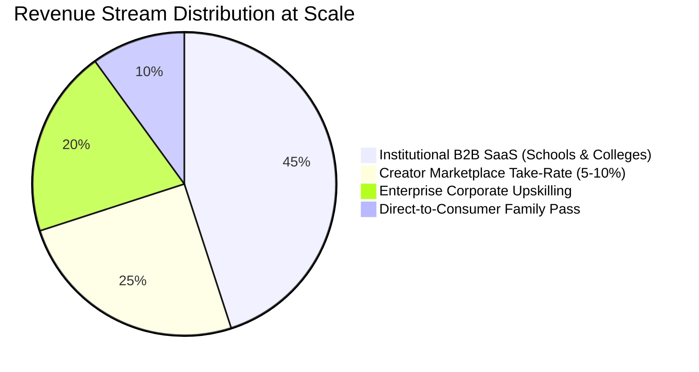

# 🚀 The Shopify of AI-Native Education (EduOS)

> **"What Shopify did for commerce, EduOS does for education: enabling any school, university, or educator to roll out entire accredited subjects 100% powered by autonomous Socratic AI agents—without human lecturers."**

---

## 🌟 Executive Summary & The Trillion-Dollar Thesis

Global education is trapped in an archaic, industrial-era delivery model: **one teacher lecturing to 30–40 students of wildly varying aptitudes**. The result is a dual crisis:
1. **Severe Global Teacher Shortages:** Chronic burnout, low faculty retention, and multi-billion-dollar payroll overheads for universities and school districts.
2. **The "Bloom's 2 Sigma" Deficit:** Educational psychologist Benjamin Bloom proved that an average student tutored **one-on-one** using mastery techniques performs **two standard deviations (98th percentile)** above conventionally instructed students. Historically, 1-on-1 human tutoring was economically impossible to scale to millions of learners.

**The Solution:** **EduOS**—the world’s first autonomous learning infrastructure platform. 

Instead of building individual learning apps one by one, EduOS is a **multi-tenant platform** where an institution or creator drops in raw textbooks, syllabi, or accreditation rubrics, and the engine automatically compiles a fully interactive, white-labeled, gamified learning application with 24/7 Socratic AI coaching.

---

## 🏛️ System Architecture: The Curriculum Compiler

```text
       [ Educator / Institution / Creator ]
                        │
                        ▼ (Uploads PDF syllabus, slides, Common Core/ABET standards)
  ┌──────────────────────────────────────────────────────────────┐
  │                 EduOS AI Curriculum Compiler                 │
  ├──────────────────────────────────────────────────────────────┤
  │ 1. Concept Decomposition (Knowledge Dependency Graph)        │
  │ 2. Socratic Persona Synthesis (Grade-adapted tone)           │
  │ 3. CRA Manipulative & Simulator Auto-Generator               │
  │ 4. Spaced Repetition (SM-2) Flashcard Synthesizer            │
  │ 5. Branching Narrative Reader & Bloom's Question Generator   │
  │ 6. Real-Time Misconception Diagnostic Rules                  │
  └──────────────────────────────────────────────────────────────┘
                        │
                        ▼ (One-Click Instant Rollout)
  ┌──────────────────────────────────────────────────────────────┐
  │          White-Labeled Storefront & Learning Portal          │
  │    (e.g., learn.mit.edu · apexacademy.org · satprep.ai)      │
  ├──────────────────────────────────────────────────────────────┤
  │ • 1-on-1 Socratic AI Companion active 24/7 in 50+ languages  │
  │ • Zero grading or lecture burden on human staff              │
  │ • Administrators see real-time cognitive misconception maps  │
  └──────────────────────────────────────────────────────────────┘
```

### The 4 Autonomous Pillars Built Into Every Course
1. **Math & Quantitative Sciences:** Concrete-Representational-Abstract (CRA) virtual manipulatives, ten-frames, geometry canvases, and step-by-step arithmetic scaffolding.
2. **Languages & Humanities:** Native-voice Web Speech synthesis, 3D tactile flashcards, and SuperMemo-2 (SM-2) spaced repetition intervals to permanently beat the Ebbinghaus forgetting curve.
3. **Literacy & Reading Comprehension:** Lexile-calibrated branching narratives with zero-friction click-to-define contextual glossaries and in-story Bloom's taxonomy inference checks.
4. **Computer Science & Engineering:** Live in-browser code sandboxes with Socratic AST debuggers that diagnose logical bugs without giving away solutions.

---

## 💼 Monetization Strategy: 4 Scalable Revenue Streams

To achieve a **$1 Billion+ valuation (Unicorn Status)** within 4–5 years, EduOS leverages a hybrid **B2B SaaS + Marketplace Take-Rate** model:



### 1. Institutional B2B SaaS (Schools, Districts & Universities)
* **Pricing:** **$20 to $50 per student / year** (tiered by school size).
* **Value Metric:** An average university spends $35M+ annually on adjunct faculty, TAs, and remedial instruction. EduOS can automate 100% of remedial math, intro language, and entry-level CS for **$350K/year**—saving the university 90% while dramatically improving student graduation rates.
* **Contract Value:** $50K – $500K Annual Contract Value (ACV) with multi-year lock-ins.

### 2. The "Shopify Creator" Take-Rate (Course Marketplace)
* **Model:** Any tutor, influencer, or subject matter expert can upload their niche curriculum (e.g., *MCAT Biology Socratic Sprint*, *CFA Level 1 Mastery*, *AP Physics Boot Camp*) and sell it to consumers under their own domain.
* **Monetization:** EduOS takes a **5% to 10% platform transaction fee** + standard payment processing on all student enrollments.

### 3. Enterprise Corporate Upskilling & Compliance
* **Pricing:** **$60 to $120 per employee / month**.
* **Target:** Fortune 1,000 enterprises training tens of thousands of employees on cybersecurity protocols, HIPAA/SOC-2 compliance, cloud architectures (AWS/GCP/Azure), and internal software tools.

### 4. Direct-to-Consumer (B2C) "Family Super-Tutor Pass"
* **Pricing:** **$19.99 / month per family**.
* **Value Pitch:** Replaces expensive $60–$100/hr private tutors (Kumon, Varsity Tutors) with an unlimited, personalized, gamified 24/7 AI learning companion across every grade and subject.

---

## 📈 5-Year Financial Roadmap & Unit Economics

| Year | Milestone & Focus | Active Learners | ARR (Annual Recurring Revenue) | Implied Valuation |
| :---: | :--- | :---: | :---: | :---: |
| **Year 1** | Beachhead in Test-Prep (SAT/ACT, NCLEX, Coding Bootcamps) | 25,000 | **$2.5M** | $25M |
| **Year 2** | Expansion into Charter Networks & Private High Schools | 120,000 | **$9.6M** | $100M |
| **Year 3** | Higher Ed Partnerships & International Launch (India & LATAM) | 600,000 | **$36.0M** | $380M |
| **Year 4** | Global Creator Marketplace Launch & Corporate Training | 2,200,000 | **$88.0M** | $900M |
| **Year 5** | Autonomous Global Learning OS across 100+ countries | 5,000,000+ | **$180.0M+** | **$1.8B+ (Unicorn)** |

---

## 🌍 Go-To-Market (GTM) Playbook

### Phase 1: High-Stakes Standardized Testing (The Beachhead)
* *Why:* Parents and students have intense urgency and high willingness to pay for SAT, ACT, AP, and professional licensing exams (NCLEX, Series 7). Outcomes are measurable within 90 days.
* *Tactic:* Launch pre-compiled, high-yield diagnostic game tracks that guarantee score increases.

### Phase 2: High-Growth Emerging Markets (India, LATAM, Southeast Asia)
* *Why:* In developing nations, the teacher-to-student ratio frequently exceeds 1:60, and access to elite university faculty is near zero.
* *Tactic:* Deploy localized multi-lingual AI tutoring in Hindi, Spanish, and Portuguese using low-latency Web Speech APIs that run smoothly even on low-cost mobile devices.

### Phase 3: Institutional Adoption (The Replacement of Legacy LMS)
* *Why:* Platforms like Canvas and Blackboard are passive file repositories (digital filing cabinets). EduOS is an **active, cognitive learning engine**.
* *Tactic:* Offer 1-click migration: import an existing Canvas course and automatically convert it into an interactive game app.

---

## 🛡️ Strategic Moats & Defensibility

1. **Longitudinal Cognitive Memory Graph:** Unlike generic chatbots that forget user interactions after a session, EduOS maps each student's personal knowledge decay curve over years, knowing precisely when to trigger spaced repetition.
2. **Proprietary Misconception Taxonomy:** Millions of student interaction traces generate an unmatched database of why learners get stuck on specific sub-concepts (e.g., regrouping bugs vs. sign errors).
3. **Zero-Dependency Edge Audio & Graphics:** By using client-side Web Audio API synthesis and Web Speech APIs, EduOS operates at near-zero inference cost compared to server-heavy video avatar models.

---

## 🤝 The Nerdy / Varsity Tutors Opportunity

Nerdy (NYSE: NRDY) already has **40,000+ vetted experts** and catalogs **3,000+ subjects**. However, live human tutoring cannot serve learners at 2:00 AM or scale down to $20/month budgets.

**The Pitch to Nerdy Leadership:**
> *"By acquiring or building EduOS, Nerdy becomes not just a tutoring company, but the **underlying infrastructure of global education**. Human tutors become executive mentors and accountability coaches, while the EduOS AI layer powers 100% of daily practice, homework help, and autonomous curriculum delivery."*

---

*Authored for the Nerdy AI Hackathon Suite · [nerdy-hackathon-repo](https://github.com/SKannaian/nerdy-hackathon-repo)*
